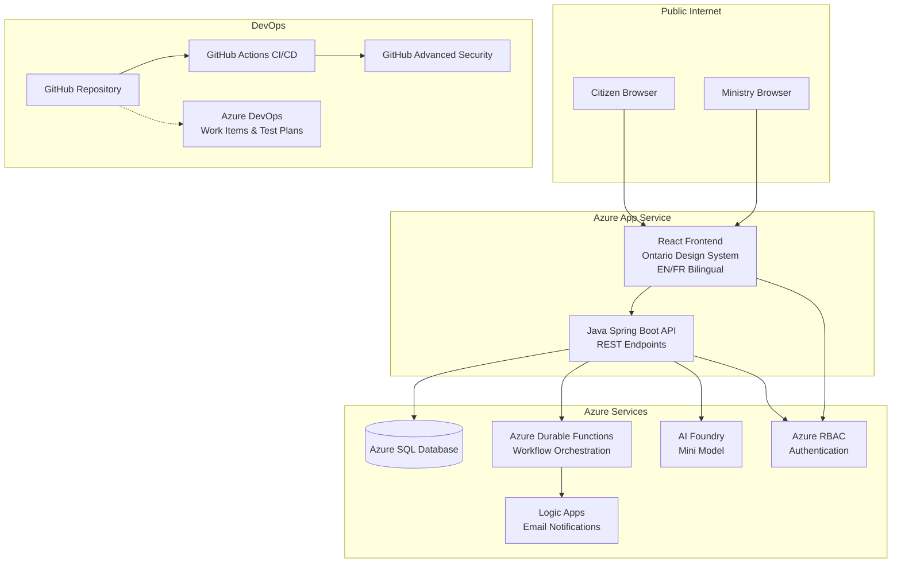

<!-- markdownlint-disable-file -->
# Implementation Details: OPS Developer Day 2026 Pre-Demo Setup

## Context Reference

Sources:
- [.copilot-tracking/research/2026-02-16-ops-devday-demo-research.md](../research/2026-02-16-ops-devday-demo-research.md) - Primary research with demo schedule, ADO hierarchy, API schema, tagged commits plan.
- [.copilot-tracking/subagent/2026-02-16/demo-structure-research.md](../subagent/2026-02-16/demo-structure-research.md) - Detailed custom instructions content, repo structure, architecture diagram, data dictionary, WCAG 2.2 checklist.

## Implementation Phase 1: Repository Custom Instructions

<!-- parallelizable: true -->

### Step 1.1: Create `.github/copilot-instructions.md`

Create the repository-wide Copilot instructions file that applies to all suggestions across the project. This file provides project context, tech stack, coding standards, accessibility rules, and Git workflow conventions.

Content should include:

```markdown
# OPS Program Approval Demo - Copilot Instructions

## Project Overview
This is the Developer Day 2026 demo for the Ontario Public Sector (OPS). It is a
full-stack web application where citizens submit program requests and Ministry
employees review them through an internal portal.

## Tech Stack
- **Frontend:** React with TypeScript, Vite, i18next for EN/FR bilingual support
- **Backend:** Java 21, Spring Boot 3.x, Maven
- **Database:** Azure SQL
- **Cloud:** Azure App Service, Durable Functions, Logic Apps, AI Foundry
- **CI/CD:** GitHub Actions
- **Project Management:** Azure DevOps (User Stories, Test Plans)

## Coding Standards

### General
- All user-facing text must be bilingual (English and French) using i18next keys,
  never hardcoded strings.
- All UI components must meet WCAG 2.2 Level AA accessibility standards.
- All UI must follow the Ontario Design System (https://designsystem.ontario.ca/).
- Use semantic HTML elements (nav, main, section, article, aside, header, footer).
- Every form input must have an associated label and appropriate autocomplete attribute.

### Frontend (React + TypeScript)
- Use functional components with hooks exclusively.
- Use the Ontario Design System CSS classes with BEM naming (e.g., ontario-button,
  ontario-input).
- Minimum touch target size: 24x24 CSS pixels (WCAG 2.5.8).
- Color contrast: minimum 4.5:1 for normal text, 3:1 for large text (WCAG 1.4.3).
- Include aria-labels, aria-describedby, and role attributes where needed.
- Use react-router for navigation with descriptive page titles.
- All forms must include error identification (WCAG 3.3.1) and error suggestions
  (WCAG 3.3.3).

### Backend (Java / Spring Boot)
- Follow RESTful API design conventions.
- Use Spring Data JPA for database access.
- Include input validation on all endpoints (@Valid, @NotNull, @Size).
- Return proper HTTP status codes (200, 201, 400, 404, 500).
- Include request/response DTOs separate from entity classes.
- Use Spring MessageSource for backend bilingual messages.

### Database
- Use Flyway-style versioned migration scripts (V001__, V002__, etc.).
- Table names: lowercase, underscores, singular (e.g., program, program_type).
- Column names: lowercase, underscores (e.g., program_name, created_date).
- Always include: id (PK), created_date, updated_date, created_by columns.

### Testing
- Frontend: Jest + React Testing Library.
- Backend: JUnit 5 + Mockito + Spring Boot Test.
- Target 80% code coverage minimum.
- Include accessibility tests using jest-axe for React components.

### CI/CD
- GitHub Actions workflows in .github/workflows/.
- Validate both backend and frontend on every pull request.
- Include linting, unit tests, and build checks in CI.

### Git Workflow
- Branch naming: feature/{work-item-id}-short-description
- Commit messages: Include AB#{work-item-id} for ADO linking.
- PR descriptions: Include Fixes AB#{work-item-id} to auto-close.

## Repository Layout
- backend/ - Java Spring Boot API
- frontend/ - React TypeScript application
- database/ - SQL migration scripts
- infra/ - Azure Bicep templates
- docs/ - Architecture, data dictionary, design documents
```

Files:
* `.github/copilot-instructions.md` - New file, repository-wide Copilot instructions.

Success criteria:
* File exists at `.github/copilot-instructions.md`.
* Contains project context, all six coding standards sections, and repository layout reference.

Context references:
* [demo-structure-research.md](../subagent/2026-02-16/demo-structure-research.md) (Lines 227-300) - Full custom instructions content.
* [2026-02-16-ops-devday-demo-research.md](../research/2026-02-16-ops-devday-demo-research.md) (Lines 240-269) - Configuration example for copilot-instructions.md.

Dependencies:
* None. This step has no prerequisites.

### Step 1.2: Create `.github/instructions/java.instructions.md`

Create path-specific instructions for Java backend code. This file applies only to files matching `backend/**/*.java`.

Content should include:

```markdown
---
applyTo: "backend/**/*.java"
---
# Java / Spring Boot Instructions

- Use Java 21 features (records, sealed classes, pattern matching) where appropriate.
- Follow Spring Boot 3.x conventions.
- Use constructor injection, not field injection.
- Include Javadoc on all public classes and methods.
- Use Lombok @Data, @Builder, @AllArgsConstructor for DTOs.
- Handle exceptions with @ControllerAdvice and return ProblemDetail responses.
- Use Spring Data JPA repositories with method-name-based queries.
- Include @Valid on all request body parameters.
- Use ResponseEntity with appropriate HTTP status codes.
- Organize packages: config/, controller/, service/, repository/, model/, dto/.
- Unit tests use JUnit 5, Mockito, and @WebMvcTest for controllers.
- Integration tests use @SpringBootTest with an in-memory database.
```

Files:
* `.github/instructions/java.instructions.md` - New file.

Success criteria:
* File exists with correct `applyTo: "backend/**/*.java"` frontmatter.
* Covers constructor injection, Lombok, exception handling, and test conventions.

Context references:
* [demo-structure-research.md](../subagent/2026-02-16/demo-structure-research.md) (Lines 308-318) - Java path-specific instructions content.

Dependencies:
* None.

### Step 1.3: Create `.github/instructions/react.instructions.md`

Create path-specific instructions for React/TypeScript frontend code. This file applies to `frontend/**/*.tsx` and `frontend/**/*.ts`.

Content should include:

```markdown
---
applyTo: "frontend/**/*.tsx,frontend/**/*.ts"
---
# React / TypeScript Instructions

## Ontario Design System
- Use Ontario Design System classes from @ongov/ontario-design-system-global-styles.
- Install with: npm install --save @ongov/ontario-design-system-global-styles
- Import theme: @import '@ongov/ontario-design-system-global-styles/dist/styles/css/compiled/ontario-theme.css'
- BEM naming convention: .ontario-{block}__{element}--{modifier}
- Wrap all pages in Ontario header and footer layout components.

## Internationalization
- Use i18next useTranslation() hook for all user-visible text.
- Never hardcode English or French strings directly in components.
- Store translations in public/locales/en/translation.json and public/locales/fr/translation.json.
- Set the lang attribute on the html element dynamically when language changes.
- Use lang attribute on individual elements when mixing languages (WCAG 3.1.2).

## WCAG 2.2 Accessibility
- Ensure focus indicators are visible on all interactive elements (2.4.7).
- Focus must not be obscured by sticky headers or modals (2.4.11).
- Provide non-drag alternatives for any drag interactions (2.5.7).
- Minimum touch target size: 24x24 CSS pixels (2.5.8).
- No cognitive function tests for authentication (3.3.8).
- Pre-fill previously entered data to avoid redundant entry (3.3.7).
- Place help mechanisms in consistent locations across pages (3.2.6).
- Identify form errors in text, not just color (3.3.1).
- Provide error suggestions for user input errors (3.3.3).
- Use ARIA live regions for dynamic status messages (4.1.3).

## Component Patterns
- Use functional components with hooks exclusively.
- Extract reusable UI into components/common/.
- Page components go in pages/.
- API calls go in services/api.ts.
- Custom hooks go in hooks/.
- TypeScript types go in types/.
```

Files:
* `.github/instructions/react.instructions.md` - New file.

Success criteria:
* File exists with correct `applyTo` frontmatter covering `.tsx` and `.ts` files.
* Covers Ontario Design System, i18next, all applicable WCAG 2.2 AA criteria, and component patterns.

Context references:
* [demo-structure-research.md](../subagent/2026-02-16/demo-structure-research.md) (Lines 320-338) - React path-specific instructions content.
* [demo-structure-research.md](../subagent/2026-02-16/demo-structure-research.md) (Lines 560-603) - WCAG 2.2 compliance checklist.

Dependencies:
* None.

### Step 1.4: Create `.github/instructions/sql.instructions.md`

Create path-specific instructions for SQL migration scripts. This file applies to `database/**/*.sql`.

Content should include:

```markdown
---
applyTo: "database/**/*.sql"
---
# Azure SQL Instructions

- Target Azure SQL Database.
- Use versioned migration naming: V{number}__{description}.sql (double underscore).
- Include IF NOT EXISTS guards on all CREATE TABLE and CREATE INDEX statements.
- Use NVARCHAR for all text columns to support bilingual content (EN/FR).
- Always include primary key constraints on every table.
- Add appropriate indexes for columns used in WHERE clauses and JOINs.
- Include NOT NULL constraints on required columns.
- Use DATETIME2 for all timestamp columns (not DATETIME).
- Include created_date and updated_date columns on all entity tables.
- Add foreign key constraints with descriptive constraint names.
- Use BIGINT for auto-increment primary keys on high-volume tables.
- Use INT for lookup table primary keys.
- Include comments for non-obvious column purposes.
- Seed data scripts should use MERGE or INSERT with NOT EXISTS guards for idempotency.
```

Files:
* `.github/instructions/sql.instructions.md` - New file.

Success criteria:
* File exists with correct `applyTo: "database/**/*.sql"` frontmatter.
* Covers NVARCHAR, versioned naming, IF NOT EXISTS guards, Azure SQL conventions.

Context references:
* [demo-structure-research.md](../subagent/2026-02-16/demo-structure-research.md) (Lines 340-353) - SQL path-specific instructions content.

Dependencies:
* None.

### Step 1.5: Create `.github/instructions/cicd.instructions.md`

Create path-specific instructions for GitHub Actions CI/CD workflow files. This file applies to `.github/workflows/**`.

Content should include:

```markdown
---
applyTo: ".github/workflows/**"
---
# GitHub Actions CI/CD Instructions

- Use the latest stable versions of official GitHub Actions (actions/checkout@v4, actions/setup-java@v4, actions/setup-node@v4).
- Pin action versions to major version tags, not commit SHAs.
- Run CI on pull_request events targeting main branch.
- Run CD on push events to main branch (after CI passes).
- Use job-level permissions with least privilege (contents: read by default).
- Cache Maven dependencies using actions/cache with ~/.m2/repository path.
- Cache npm dependencies using actions/cache with ~/.npm path.
- Use matrix strategy for testing across multiple Java or Node versions when applicable.
- Include explicit timeout-minutes on long-running jobs (default: 30).
- Use environment variables for configuration, not hardcoded values.
- Separate CI (build + test) and CD (deploy) into distinct workflow files.
- Include a health check step after deployment.
- Use GitHub environment secrets for Azure deployment credentials.
```

Files:
* `.github/instructions/cicd.instructions.md` - New file.

Success criteria:
* File exists with correct `applyTo: ".github/workflows/**"` frontmatter.
* Covers action versioning, caching, permissions, CI/CD separation.

Context references:
* [demo-structure-research.md](../subagent/2026-02-16/demo-structure-research.md) (Lines 104-115) - CI/CD and security workflow files in repo structure.

Dependencies:
* None.

### Step 1.6: Validate instruction file frontmatter and Markdown lint

Run Markdown lint on all new `.instructions.md` files. Verify that `applyTo` globs are syntactically correct and that frontmatter uses the required YAML format.

Validation commands:
* Check each file has `---` delimited frontmatter with `applyTo` key.
* Verify glob patterns do not contain invalid syntax.

## Implementation Phase 2: Architecture Documents

<!-- parallelizable: true -->

### Step 2.1: Create `docs/architecture.md`

Create the architecture document with a Mermaid diagram showing all system components, their interactions, and data flow.

Content should include:

1. **Title and overview** - One paragraph describing the system.
2. **Architecture diagram** - Mermaid `graph TB` diagram showing:
   - Citizen Browser and Ministry Browser as external actors.
   - React Frontend (Ontario Design System, EN/FR Bilingual) on Azure App Service.
   - Java Spring Boot API (REST Endpoints) on Azure App Service.
   - Azure SQL Database.
   - Azure Durable Functions (Workflow Orchestration).
   - Azure Logic Apps (Email Notifications).
   - Azure AI Foundry (Mini Model for summarization).
   - Azure RBAC (Authentication).
   - GitHub Repository, GitHub Actions CI/CD, GitHub Advanced Security.
   - Azure DevOps (Work Items and Test Plans).
3. **Component descriptions** - Tabular breakdown of each component with technology, purpose, and notes.
4. **Data flow** - Numbered steps showing how a program request flows from citizen submission through ministry review to notification.
5. **Security model** - RBAC roles, authentication flow, HTTPS enforcement.
6. **Deployment topology** - Azure App Service frontend + backend, Azure SQL, Functions, Logic Apps.

Use the Mermaid diagram from the subagent research as the starting point:



Files:
* `docs/architecture.md` - New file.

Success criteria:
* File exists at `docs/architecture.md`.
* Mermaid diagram renders correctly with all components.
* Includes component table, data flow steps, security model, and deployment topology sections.

Context references:
* [demo-structure-research.md](../subagent/2026-02-16/demo-structure-research.md) (Lines 382-420) - Architecture diagram Mermaid source.
* [2026-02-16-ops-devday-demo-research.md](../research/2026-02-16-ops-devday-demo-research.md) (Lines 131-180) - Demo schedule and infrastructure context.

Dependencies:
* None.

### Step 2.2: Create `docs/data-dictionary.md`

Create the data dictionary documenting all database tables, columns, data types, constraints, and relationships.

Content should include:

1. **Overview** - Purpose of the data dictionary and database technology (Azure SQL).
2. **Entity Relationship Diagram** - Mermaid ER diagram showing `program`, `program_type`, and `notification` tables with relationships.
3. **Table: program** - Full column listing:
   - `id` (BIGINT, PK, IDENTITY) - Auto-increment primary key.
   - `program_name` (NVARCHAR(200), NOT NULL) - Name of the program.
   - `program_description` (NVARCHAR(MAX), NOT NULL) - Detailed description.
   - `program_type_id` (INT, FK to program_type.id, NOT NULL) - Program type reference.
   - `status` (NVARCHAR(50), NOT NULL, DEFAULT 'DRAFT') - DRAFT, SUBMITTED, UNDER_REVIEW, APPROVED, REJECTED.
   - `submitted_by` (NVARCHAR(100)) - Citizen email or user ID.
   - `reviewed_by` (NVARCHAR(100)) - Ministry employee who reviewed.
   - `review_comments` (NVARCHAR(MAX)) - Comments from reviewer.
   - `document_url` (NVARCHAR(500)) - URL to uploaded supporting document.
   - `created_date` (DATETIME2, NOT NULL, DEFAULT GETUTCDATE()) - Record creation timestamp.
   - `updated_date` (DATETIME2, NOT NULL, DEFAULT GETUTCDATE()) - Last modification timestamp.
4. **Table: program_type** - Lookup table:
   - `id` (INT, PK, IDENTITY) - Auto-increment primary key.
   - `type_name_en` (NVARCHAR(100), NOT NULL) - English type name.
   - `type_name_fr` (NVARCHAR(100), NOT NULL) - French type name.
5. **Table: notification** - Email tracking:
   - `id` (BIGINT, PK, IDENTITY) - Auto-increment primary key.
   - `program_id` (BIGINT, FK to program.id, NOT NULL) - Reference to program.
   - `recipient_email` (NVARCHAR(200), NOT NULL) - Email address.
   - `notification_type` (NVARCHAR(50), NOT NULL) - SUBMISSION_CONFIRMATION, DECISION.
   - `sent_date` (DATETIME2) - When notification was sent.
   - `status` (NVARCHAR(50), NOT NULL, DEFAULT 'PENDING') - PENDING, SENT, FAILED.
6. **Seed data** - Initial `program_type` values (e.g., "Health", "Education", "Infrastructure", "Social Services", "Environment").
7. **Indexes** - List of recommended indexes for query performance.

Files:
* `docs/data-dictionary.md` - New file.

Success criteria:
* File exists at `docs/data-dictionary.md`.
* Contains ER diagram (Mermaid), all three tables with full column details.
* Includes seed data values and index recommendations.

Context references:
* [demo-structure-research.md](../subagent/2026-02-16/demo-structure-research.md) (Lines 422-460) - Data dictionary table with column types.
* [2026-02-16-ops-devday-demo-research.md](../research/2026-02-16-ops-devday-demo-research.md) (Lines 201-220) - API and schema documentation.

Dependencies:
* None.

### Step 2.3: Create `docs/design-document.md`

Create the technical design document covering decisions, security model, deployment strategy, and bilingual approach.

Content should include:

1. **Overview** - One paragraph summary of the application purpose.
2. **Technical Decisions**:
   - **Frontend framework**: React + TypeScript + Vite. Rationale: TypeScript improves Copilot suggestions; Vite provides fast HMR for live demos.
   - **Backend framework**: Java 21 + Spring Boot 3.x + Maven. Rationale: Standard OPS stack with excellent Copilot support.
   - **Database**: Azure SQL. Rationale: Managed service, bilingual support via NVARCHAR.
   - **Repository layout**: Monorepo. Rationale: Single VS Code window for demo; no repo switching.
   - **Internationalization**: i18next + react-i18next. Rationale: Industry standard for React bilingual support.
   - **Ontario Design System integration**: CSS-only approach via `@ongov/ontario-design-system-global-styles`. Rationale: Simpler integration than Web Components for a demo.
   - **Accessibility**: WCAG 2.2 AA compliance. Rationale: Ontario government requirement.
3. **Security Model**:
   - Azure RBAC for role-based access (Citizen, Ministry Employee).
   - HTTPS enforced on all endpoints.
   - CORS configuration allowing frontend origin only.
   - Input validation on all API endpoints.
   - No secrets in code (use Azure Key Vault or environment variables).
4. **Deployment Strategy**:
   - Frontend: Azure App Service (static build output from Vite).
   - Backend: Azure App Service (Java JAR).
   - Database: Azure SQL Database (pre-provisioned).
   - Workflows: Azure Durable Functions.
   - Notifications: Azure Logic Apps.
   - AI: Azure AI Foundry mini model for notification summarization.
   - CI/CD: GitHub Actions for build, test, and deploy.
5. **Bilingual Approach**:
   - Frontend: i18next with JSON translation files in `public/locales/{lang}/translation.json`.
   - Backend: Spring MessageSource with properties files in `resources/messages/`.
   - Database: NVARCHAR columns; `program_type` table has `_en` and `_fr` columns.
   - HTML `lang` attribute set dynamically on `<html>` element.
   - WCAG 3.1.1 (Language of Page) and 3.1.2 (Language of Parts) compliance.
6. **API Design**:
   - RESTful API with `/api/programs` base path.
   - POST `/api/programs` - Submit new program request.
   - GET `/api/programs` - List programs (supports `?search=` query param).
   - GET `/api/programs/{id}` - Get program details.
   - PUT `/api/programs/{id}/review` - Approve or reject program.
   - Standard HTTP status codes: 200, 201, 400, 404, 500.
   - JSON request/response bodies with DTOs.
7. **Error Handling**:
   - Backend: `@ControllerAdvice` with ProblemDetail responses (RFC 7807).
   - Frontend: Error boundaries for component errors; toast notifications for API errors.
   - Forms: Inline error messages per field (WCAG 3.3.1).

Files:
* `docs/design-document.md` - New file.

Success criteria:
* File exists at `docs/design-document.md`.
* Contains all seven sections with rationale for each decision.
* Security model covers RBAC, CORS, HTTPS, and input validation.

Context references:
* [demo-structure-research.md](../subagent/2026-02-16/demo-structure-research.md) (Lines 200-225) - Key structural decisions and rationale.
* [2026-02-16-ops-devday-demo-research.md](../research/2026-02-16-ops-devday-demo-research.md) (Lines 273-316) - Preferred approach and implementation details.
* [README.md](../../README.md) (Lines 25-35) - Technical stack table.

Dependencies:
* None.

## Implementation Phase 3: Directory Scaffolding and CI Pipeline

<!-- parallelizable: true -->

### Step 3.1: Create directory placeholders

Create `.gitkeep` files in empty directories so Git tracks the directory structure. These directories will be populated during the live demo.

Directories to create:
- `database/migrations/.gitkeep`
- `backend/.gitkeep`
- `frontend/.gitkeep`
- `infra/.gitkeep`

Files:
* `database/migrations/.gitkeep` - Empty file to preserve directory.
* `backend/.gitkeep` - Empty file to preserve directory.
* `frontend/.gitkeep` - Empty file to preserve directory.
* `infra/.gitkeep` - Empty file to preserve directory.

Success criteria:
* All four directories exist in the repository.
* `.gitkeep` files are committed.

Dependencies:
* None.

### Step 3.2: Expand `.github/workflows/ci.yml`

Modify the existing CI workflow to add placeholder build and test jobs for backend and frontend while preserving the existing tag job.

The expanded workflow should:

1. **Trigger on pull_request** targeting main (in addition to existing push trigger).
2. **Add `backend-ci` job**:
   - Runs on `ubuntu-latest`.
   - Checks out code.
   - Sets up Java 21 with `actions/setup-java@v4`.
   - Caches Maven dependencies.
   - Runs `mvn clean verify` in `backend/` directory.
   - Conditional: only runs when files in `backend/` change (using paths filter or a check step).
3. **Add `frontend-ci` job**:
   - Runs on `ubuntu-latest`.
   - Checks out code.
   - Sets up Node.js 20 with `actions/setup-node@v4`.
   - Caches npm dependencies.
   - Runs `npm ci`, `npm run lint`, `npm test`, and `npm run build` in `frontend/` directory.
   - Conditional: only runs when files in `frontend/` change.
4. **Keep existing `tag` job** unchanged on push to main.
5. Use `continue-on-error: false` and `timeout-minutes: 30`.

The backend and frontend jobs should use `if: hashFiles('backend/pom.xml') != ''` and `if: hashFiles('frontend/package.json') != ''` guards so they skip gracefully when project files do not exist yet (since scaffolding is built live).

Files:
* `.github/workflows/ci.yml` - Modify existing file.

Success criteria:
* CI workflow YAML is valid.
* Backend and frontend jobs exist with conditional execution.
* Existing tag job is preserved.
* Jobs skip gracefully when project files do not exist.

Context references:
* [ci.yml](../../.github/workflows/ci.yml) (Lines 1-50) - Current workflow content.
* [demo-structure-research.md](../subagent/2026-02-16/demo-structure-research.md) (Lines 108-113) - CI, CD, and security workflow files.

Dependencies:
* None.

### Step 3.3: Validate CI workflow syntax

Validate the expanded CI workflow YAML for correct syntax. Check for:
- Valid YAML structure.
- Correct GitHub Actions syntax (on, jobs, steps).
- Correct action version references (v4).
- Proper indentation and quoting.

Validation commands:
* `yamllint .github/workflows/ci.yml` (if available) or manual YAML structure review.

## Implementation Phase 4: ADO Work Items

<!-- parallelizable: false -->

This phase must be sequential because child work items require parent IDs from prior steps.

### Step 4.1: Enable Epics backlog level

The research notes that Epics backlog level may be hidden by default. Check if Epics are enabled in the ADO project settings and enable them if needed.

Use ADO MCP tools to verify. If Epics are not available, the implementation agent should note this and the user may need to enable it manually through the ADO web UI.

Files:
* No files. ADO configuration only.

Success criteria:
* Epics are available as a work item type in the project.

Dependencies:
* ADO MCP tools (`mcp_ado_wit_get_work_item_type` or similar).

### Step 4.2: Create the Epic

Create one Epic work item:

| Field | Value |
|-------|-------|
| Title | OPS Program Approval System |
| Description | Full-stack web application for Ontario Public Sector program approval. Citizens submit program requests through a public portal. Ministry employees review and approve or reject submissions through an internal portal. Notifications are sent to citizens on decision. |
| Tags | Agentic AI |
| State | New |

Record the Epic ID for use in subsequent steps.

Files:
* No files. ADO work item creation only.

Success criteria:
* Epic exists in ADO with title "OPS Program Approval System" and tag "Agentic AI".
* Epic ID is recorded for Feature parenting.

Dependencies:
* Step 4.1 (Epics enabled).
* ADO MCP tool: `mcp_ado_wit_create_work_item`.

### Step 4.3: Create 8 Features under the Epic

Create the following Features, each as a child of the Epic, each tagged `Agentic AI`:

| # | Feature Title |
|---|--------------|
| 1 | Infrastructure Setup |
| 2 | Database Layer |
| 3 | Backend API |
| 4 | Citizen Portal |
| 5 | Ministry Portal |
| 6 | Quality Assurance |
| 7 | CI/CD Pipeline |
| 8 | Live Change Demo |

Each Feature should have a brief description summarizing its scope (1-2 sentences).

Record all Feature IDs for use when creating User Stories.

Files:
* No files. ADO work item creation only.

Success criteria:
* 8 Features exist in ADO, each linked as child of the Epic.
* All tagged `Agentic AI`.
* Feature IDs recorded for User Story parenting.

Dependencies:
* Step 4.2 (Epic ID).
* ADO MCP tools: `mcp_ado_wit_create_work_item`, `mcp_ado_wit_add_child_work_items`.

### Step 4.4: Create ~30 User Stories under the Features

Create User Stories under each Feature. All tagged `Agentic AI`. Assign priority based on demo execution order.

**Feature 1: Infrastructure Setup** (5 stories)

| # | User Story Title | Priority |
|---|-----------------|----------|
| 1 | Provision Azure SQL Database | 1 |
| 2 | Deploy Azure App Service for backend | 1 |
| 3 | Deploy Azure App Service for frontend | 1 |
| 4 | Configure Azure Durable Functions | 1 |
| 5 | Set up Azure Logic Apps for notifications | 1 |

**Feature 2: Database Layer** (4 stories)

| # | User Story Title | Priority |
|---|-----------------|----------|
| 6 | Create program table schema | 2 |
| 7 | Create program_type lookup table | 2 |
| 8 | Create notification table schema | 2 |
| 9 | Seed program_type with initial data | 2 |

**Feature 3: Backend API** (5 stories)

| # | User Story Title | Priority |
|---|-----------------|----------|
| 10 | Create Spring Boot project scaffolding | 3 |
| 11 | Implement POST /api/programs (submit program) | 3 |
| 12 | Implement GET /api/programs (list programs) | 3 |
| 13 | Implement GET /api/programs/{id} (get program detail) | 3 |
| 14 | Implement PUT /api/programs/{id}/review (approve/reject) | 3 |

**Feature 4: Citizen Portal** (6 stories)

| # | User Story Title | Priority |
|---|-----------------|----------|
| 15 | Create React project with Ontario Design System | 4 |
| 16 | Build Ontario header and footer layout | 4 |
| 17 | Build program submission form | 4 |
| 18 | Implement EN/FR language toggle | 4 |
| 19 | Build submission confirmation page | 4 |
| 20 | Implement program search page | 4 |

**Feature 5: Ministry Portal** (3 stories)

| # | User Story Title | Priority |
|---|-----------------|----------|
| 21 | Build program review dashboard | 5 |
| 22 | Build program detail review page | 5 |
| 23 | Implement approve/reject workflow UI | 5 |

**Feature 6: Quality Assurance** (5 stories)

| # | User Story Title | Priority |
|---|-----------------|----------|
| 24 | Write unit tests for backend API | 6 |
| 25 | Write unit tests for React components | 6 |
| 26 | Run accessibility audit (WCAG 2.2) | 6 |
| 27 | Create test plan in Azure DevOps | 6 |
| 28 | Verify bilingual content completeness | 6 |

**Feature 7: CI/CD Pipeline** (5 stories)

| # | User Story Title | Priority |
|---|-----------------|----------|
| 29 | Create GitHub Actions CI workflow for backend | 7 |
| 30 | Create GitHub Actions CI workflow for frontend | 7 |
| 31 | Create CD workflow to deploy to Azure | 7 |
| 32 | Enable Dependabot for dependency scanning | 7 |
| 33 | Enable secret scanning and code scanning | 7 |

**Feature 8: Live Change Demo** (2 stories)

| # | User Story Title | Priority |
|---|-----------------|----------|
| 34 | Add Program Budget field to submission form | 8 |
| 35 | Update all layers for budget field (DB, API, UI, tests) | 8 |

Each User Story should include:
- **Title**: As listed above.
- **Description**: A brief description (1-2 sentences) of the acceptance criteria.
- **Tags**: `Agentic AI`.
- **Priority**: As listed above (maps to demo execution order).

Files:
* No files. ADO work item creation only.

Success criteria:
* ~35 User Stories exist in ADO, each linked to the correct parent Feature.
* All tagged `Agentic AI`.
* Priorities assigned based on demo execution order.

Dependencies:
* Step 4.3 (Feature IDs).
* ADO MCP tools: `mcp_ado_wit_create_work_item`, `mcp_ado_wit_add_child_work_items`.

### Step 4.5: Assign iteration dates

Configure the 3 default iterations in ADO:

| Iteration | Start Date | End Date | Purpose |
|-----------|-----------|---------|---------|
| Iteration 1 | 2026-02-16 | 2026-02-16 | Demo Day - All work items |
| Iteration 2 | 2026-02-17 | 2026-02-23 | Post-demo follow-up |
| Iteration 3 | 2026-02-24 | 2026-03-02 | Stretch goals |

Assign all demo User Stories to Iteration 1.

Files:
* No files. ADO configuration only.

Success criteria:
* All 3 iterations have start and end dates.
* All demo User Stories are assigned to Iteration 1.

Dependencies:
* Step 4.4 (User Stories exist).
* ADO MCP tools: `mcp_ado_work_assign_iterations` or `mcp_ado_work_list_iterations`.

## Implementation Phase 5: Git Commits and Tags

<!-- parallelizable: false -->

This phase must be sequential because each commit builds on the previous one.

### Step 5.1: Commit scaffolding files

Stage and commit all files created in Phases 1 and 3:
- `.github/copilot-instructions.md`
- `.github/instructions/java.instructions.md`
- `.github/instructions/react.instructions.md`
- `.github/instructions/sql.instructions.md`
- `.github/instructions/cicd.instructions.md`
- `.github/workflows/ci.yml` (modified)
- `database/migrations/.gitkeep`
- `backend/.gitkeep`
- `frontend/.gitkeep`
- `infra/.gitkeep`

Commit message: `feat: add repo scaffolding and custom instructions AB#{epic-id}`

Replace `{epic-id}` with the actual Epic work item ID from Step 4.2.

Files:
* All files listed above (staged for commit).

Success criteria:
* Single commit with all scaffolding files.
* Commit message includes `AB#{epic-id}`.

Dependencies:
* Phases 1, 3, and 4.2 complete.

### Step 5.2: Tag v0.1.0

Create an annotated Git tag on the scaffolding commit.

```bash
git tag -a v0.1.0 -m "Repo scaffolding complete: custom instructions, CI pipeline, directory structure"
```

Files:
* No files. Git tag only.

Success criteria:
* Tag `v0.1.0` exists on the scaffolding commit.

Dependencies:
* Step 5.1 complete.

### Step 5.3: Commit architecture docs

Stage and commit all files created in Phase 2:
- `docs/architecture.md`
- `docs/data-dictionary.md`
- `docs/design-document.md`

Commit message: `docs: add architecture, data dictionary, and design document AB#{epic-id}`

Replace `{epic-id}` with the actual Epic work item ID from Step 4.2.

Files:
* All three docs files (staged for commit).

Success criteria:
* Single commit with all architecture documents.
* Commit message includes `AB#{epic-id}`.

Dependencies:
* Step 5.2 complete.

### Step 5.4: Tag v0.2.0

Create an annotated Git tag on the architecture docs commit.

```bash
git tag -a v0.2.0 -m "Architecture and data dictionary complete"
```

Files:
* No files. Git tag only.

Success criteria:
* Tag `v0.2.0` exists on the architecture docs commit.

Dependencies:
* Step 5.3 complete.

### Step 5.5: Push all commits and tags

Push all commits and tags to the remote origin.

```bash
git push origin main --follow-tags
```

Files:
* No files. Git push only.

Success criteria:
* All commits are on remote main branch.
* Tags `v0.1.0` and `v0.2.0` are on remote.

Dependencies:
* Step 5.4 complete.

## Implementation Phase 6: Validation

<!-- parallelizable: false -->

### Step 6.1: Run full project validation

Execute all validation commands:
* Verify all expected files exist using `ls` or `Test-Path` on each path.
* Validate YAML syntax on `.github/workflows/ci.yml`.
* Review Markdown formatting on all new `.md` files.
* Confirm `applyTo` frontmatter in all instruction files.

### Step 6.2: Verify ADO work items

Using ADO MCP tools, confirm:
* Epic "OPS Program Approval System" exists with tag "Agentic AI".
* 8 Features are children of the Epic with correct titles.
* ~35 User Stories are children of correct Features with correct titles.
* All work items tagged "Agentic AI".
* User Stories assigned to Iteration 1.

### Step 6.3: Verify Git tags

Confirm:
* `v0.1.0` tag exists and points to the scaffolding commit.
* `v0.2.0` tag exists and points to the architecture docs commit.
* Both tags are on the remote.

### Step 6.4: Fix minor validation issues

Iterate on any lint errors, YAML warnings, missing fields, or formatting issues. Apply fixes directly when corrections are straightforward and isolated.

### Step 6.5: Report blocking issues

When validation failures require changes beyond minor fixes:
* Document the issues and affected files.
* Provide the user with next steps.
* Recommend additional research and planning rather than inline fixes.
* Avoid large-scale refactoring within this phase.

## Dependencies

* Git CLI for commits, tags, and push operations.
* ADO MCP tools for work item creation and iteration assignment.
* GitHub Actions YAML syntax knowledge.
* Ontario Design System v6.0.0 NPM package references.
* Mermaid diagram syntax for architecture and ER diagrams.

## Success Criteria

* All 5 instruction files exist with correct frontmatter and comprehensive standards.
* All 3 architecture documents exist with diagrams, tables, and rationale.
* CI workflow includes conditional backend and frontend jobs.
* ADO contains 1 Epic, 8 Features, and ~35 User Stories, all tagged `Agentic AI`.
* Git tags `v0.1.0` and `v0.2.0` exist on correct commits and are pushed to remote.
* Repository structure matches the monorepo layout defined in research.
