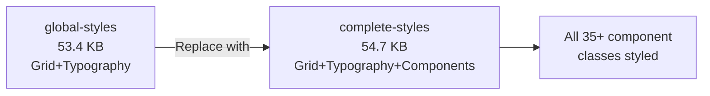

<!-- markdownlint-disable-file -->
# Task Research: Ensure UI Leverages Ontario Design System Components

Comprehensive research into aligning the frontend React application with the Ontario Design System (ODS) Figma prototyping kit. Covers CSS package gaps, component structural patterns, accessibility compliance, and a prioritized implementation plan.

## Task Implementation Requests

* Install the correct ODS CSS package (`complete-styles`) to provide all 35+ missing component class definitions
* Add Ontario trillium logo SVG to the Header and Footer components
* Add mobile hamburger menu toggle to the Header
* Add active navigation link state with `aria-current="page"` to the Header
* Fix alert sub-element structure (`ontario-alert__header` / `ontario-alert__body`) across all pages
* Fix card sub-element structure (`ontario-card__content`) in SubmitConfirmation
* Replace inline styles with ODS grid classes in SearchPrograms
* Add `ontario-table-container` wrapper in SearchPrograms
* Add Ontario favicons to replace Vite default
* Add `lang` attribute to LanguageToggle button text (WCAG 3.1.2)
* Add `aria-required="true"` to required form fields
* Sync `document.documentElement.lang` on i18n initialization
* Remove dead `/review` nav link or add the route
* Add `ontario-columns` grid wrapper to main content area in Layout

## Scope and Success Criteria

* Scope: All frontend `.tsx` components, `index.html`, `package.json`, `i18n.ts`. Excludes backend, database, and infrastructure.
* Assumptions:
  * The project continues using CSS-only ODS classes (not Web Components)
  * React 19.2 remains the target framework version
  * i18next remains the bilingual text management solution
  * `@ongov/ontario-design-system-complete-styles@6.0.0` is available on npm and compatible
* Success Criteria:
  * All 35+ ODS component classes render with proper CSS definitions at runtime
  * Header displays official Ontario trillium logo and provides mobile navigation
  * All alerts use proper `__header` / `__body` sub-element structure
  * Zero inline styles remain in component JSX
  * All WCAG 2.2 Level AA gaps identified in audit are resolved
  * Ontario government favicon replaces Vite default

## Outline

1. Critical Gap: Missing Component CSS
2. Component-by-Component Fix Plan
3. Accessibility (WCAG 2.2) Remediation
4. i18n and Language Compliance
5. File Change Summary with Line References
6. Selected Approach and Rationale
7. Considered Alternatives

### Potential Next Research

* ODS Web Components React library integration
  * Reasoning: If complete-styles CSS proves insufficient for complex components (accordion, step-indicator), Web Components may be needed for those specific patterns
  * Reference: `@ongov/ontario-design-system-component-library-react@7.0.0`
* ODS Header menu-tabs and overflow-menu patterns
  * Reasoning: The Figma kit shows complex header variants with mega-menus and tabbed navigation that may be needed in future iterations
  * Reference: `complete-styles/styles/components/ontario-header-menu-tabs/`
* Jest-axe accessibility test coverage
  * Reasoning: Project instructions target 80% code coverage with jest-axe for React components; no tests exist yet
  * Reference: `.github/copilot-instructions.md` testing standards

## Research Executed

### File Analysis

* [frontend/package.json](frontend/package.json)
  * Line 13: Uses `@ongov/ontario-design-system-global-styles` `^6.0.0` — foundation-only package, missing all component CSS
* [frontend/src/main.tsx](frontend/src/main.tsx)
  * Line 3: Imports `ontario-theme.min.css` from `global-styles` — 53.4 KB, only grid/typography/spacing
  * Line 9: Uses `ontario-loading-indicator` class — no CSS definition exists
* [frontend/index.html](frontend/index.html)
  * Line 5: Uses `/vite.svg` favicon — should be Ontario government favicon
  * Line 7: Title is hardcoded English — acceptable for `<title>` but no `<meta name="description">`
* [frontend/src/components/layout/Header.tsx](frontend/src/components/layout/Header.tsx)
  * Lines 15–49: Uses 10 `ontario-header__*` classes — none have CSS definitions
  * Line 19: Ontario logo area uses text `"Ontario.ca"` instead of trillium SVG
  * Lines 27–42: Three nav links, none have active state; `/review` link at L38 has no matching route
* [frontend/src/components/layout/Footer.tsx](frontend/src/components/layout/Footer.tsx)
  * Lines 13–48: Uses 6 `ontario-footer__*` classes — none have CSS definitions
  * No Ontario logo in footer
* [frontend/src/components/layout/Layout.tsx](frontend/src/components/layout/Layout.tsx)
  * Line 18: `ontario-skip-navigation` — no CSS definition (skip link visible but unstyled)
  * Line 22: `ontario-main` — not a defined ODS class
  * Line 23–25: Content wrapped in `ontario-row` but missing `ontario-columns` constraint
* [frontend/src/components/common/LanguageToggle.tsx](frontend/src/components/common/LanguageToggle.tsx)
  * Line 22: `ontario-header__language-toggler` — no CSS definition
  * Missing `lang` attribute on button for WCAG 3.1.2
* [frontend/src/pages/SubmitProgram.tsx](frontend/src/pages/SubmitProgram.tsx)
  * Lines 117–121: Alert uses flat structure — missing `ontario-alert__header` / `ontario-alert__body`
  * Lines 128–129, 136–137, 159–160: `ontario-label__flag` — no CSS definition
  * Lines 132–139, 168–175, 204–211, 242–249: `ontario-error-messaging` — no CSS definition
  * Lines 141–157, 177–193, 213–234, 251–266, 274–283: Missing `aria-required="true"` on required inputs
* [frontend/src/pages/SubmitConfirmation.tsx](frontend/src/pages/SubmitConfirmation.tsx)
  * Lines 36–41: Alert missing sub-elements
  * Lines 43–57: Card missing `ontario-card__content` wrapper
  * Line 59: `<h3 className="ontario-h4">` — heading level/class mismatch
* [frontend/src/pages/SearchPrograms.tsx](frontend/src/pages/SearchPrograms.tsx)
  * Line 79: Inline style `{{ display: 'flex', gap: '0.5rem', alignItems: 'flex-end' }}` — should use ODS grid
  * Lines 114–124: Alert missing sub-elements
  * Line 134: Table not wrapped in `ontario-table-container`
  * Line 76: `ontario-label--visually-hidden` — no CSS definition
* [frontend/src/i18n.ts](frontend/src/i18n.ts)
  * Lines 19–22: Detection order does not include `htmlTag`; no `languageChanged` event sets `document.documentElement.lang` on init

### Code Search Results

* `ontario-header` — 10 classes used in Header.tsx, all without CSS
* `ontario-footer` — 6 classes used in Footer.tsx, all without CSS
* `ontario-alert` — Used in SubmitProgram.tsx (L118), SubmitConfirmation.tsx (L36), SearchPrograms.tsx (L115)
* `ontario-input` — Used in SubmitProgram.tsx (5 instances), SearchPrograms.tsx (L83)
* `ontario-table` — Used in SearchPrograms.tsx (L134)
* `ontario-card` — Used in SubmitConfirmation.tsx (L43)
* `inline style` — 1 instance in SearchPrograms.tsx (L79)
* CSS/SCSS files in `frontend/src/` — zero files found

### External Research

* npm `@ongov/ontario-design-system-complete-styles`
  * Contains ALL component CSS (header, footer, alert, input, table, card, label, etc.) in compiled `ontario-theme.min.css` (54.7 KB)
  * Drop-in replacement for `global-styles` — same file structure, same CSS file name
  * Includes `dist/assets/` with SVG logos for header/footer supergraphics
  * Includes `dist/scripts/` with JS for header toggle and table sorting
  * Source: npm registry, package versions 6.0.0 and 7.0.0 available
* npm `@ongov/ontario-design-system-component-library-react`
  * Stencil Web Components with React wrappers
  * v6.0.0 requires React ^18.3.0 (incompatible — project uses React 19)
  * v7.0.0 requires React ^19.2.4 (needs minor bump from project's ^19.2.0)
  * Uses Shadow DOM — blocks external CSS customization and complicates i18next integration
  * Source: npm registry
* Ontario Design System docs
  * npm packages guide explicitly states: "Most users should be using the complete styles package or one of the component library packages"
  * Source: [designsystem.ontario.ca/docs/documentation/develop/npm-packages.html](https://designsystem.ontario.ca/docs/documentation/develop/npm-packages.html)

### Project Conventions

* Standards referenced: `.github/copilot-instructions.md` — ODS compliance, WCAG 2.2 AA, BEM naming, i18next bilingual
* Instructions followed: `.github/instructions/react.instructions.md` — ODS class conventions, accessibility patterns

## Key Discoveries

### Project Structure

The frontend follows standard React + Vite conventions with components in `components/` (layout, common) and page components in `pages/`. All styling relies on a single CSS import from the ODS npm package — no custom CSS files exist in the project.

### Implementation Patterns

The project uses ODS BEM class names correctly in JSX (e.g., `ontario-form-group`, `ontario-header__nav-link`) but the installed package (`global-styles`) only provides 6 of these classes with CSS definitions. The remaining 35+ classes render completely unstyled.

### Complete Examples

#### Fix 1: Package Swap (Critical)

```bash
cd frontend
npm uninstall @ongov/ontario-design-system-global-styles
npm install @ongov/ontario-design-system-complete-styles@6.0.0
```

```tsx
// frontend/src/main.tsx — Line 3
// Before:
import '@ongov/ontario-design-system-global-styles/styles/css/compiled/ontario-theme.min.css';
// After:
import '@ongov/ontario-design-system-complete-styles/styles/css/compiled/ontario-theme.min.css';
```

#### Fix 2: Header with Ontario Trillium Logo and Active Nav

```tsx
// frontend/src/components/layout/Header.tsx — Full replacement
import { useTranslation } from 'react-i18next';
import { Link, useLocation } from 'react-router-dom';
import { LanguageToggle } from '../common/LanguageToggle';

export function Header() {
  const { t } = useTranslation();
  const location = useLocation();

  const navItems = [
    { to: '/', labelKey: 'header.nav.submit' },
    { to: '/search', labelKey: 'header.nav.search' },
  ];

  return (
    <header className="ontario-header" role="banner">
      <div className="ontario-row">
        <div className="ontario-header__container">
          <a href="https://www.ontario.ca" className="ontario-header__logo-container" aria-label="Ontario.ca">
            <svg className="ontario-header__logo" /* Ontario trillium SVG */ />
          </a>
          <LanguageToggle />
        </div>
      </div>
      <div className="ontario-row">
        <nav className="ontario-header__nav" aria-label={t('header.title')}>
          <ul className="ontario-header__nav-list">
            {navItems.map(({ to, labelKey }) => (
              <li key={to} className="ontario-header__nav-item">
                <Link
                  to={to}
                  className={`ontario-header__nav-link${location.pathname === to ? ' ontario-header__nav-link--active' : ''}`}
                  aria-current={location.pathname === to ? 'page' : undefined}
                >
                  {t(labelKey)}
                </Link>
              </li>
            ))}
          </ul>
        </nav>
      </div>
      <div className="ontario-row">
        <h1 className="ontario-header__heading">{t('header.title')}</h1>
      </div>
    </header>
  );
}
```

#### Fix 3: Alert Sub-Element Pattern

```tsx
// Pattern for all alert instances (SubmitProgram, SubmitConfirmation, SearchPrograms)
// Before:
<div className="ontario-alert ontario-alert--error" role="alert">
  <p>{errorMessage}</p>
</div>

// After:
<div className="ontario-alert ontario-alert--error" role="alert">
  <div className="ontario-alert__header">
    <h3 className="ontario-alert__header-title">{t('error.title')}</h3>
  </div>
  <div className="ontario-alert__body">
    <p>{errorMessage}</p>
  </div>
</div>
```

#### Fix 4: Card Sub-Element Pattern

```tsx
// SubmitConfirmation.tsx — Lines 43–57
// Before:
<div className="ontario-card">
  <dl className="ontario-description-list">...</dl>
</div>

// After:
<div className="ontario-card">
  <div className="ontario-card__content">
    <dl className="ontario-description-list">...</dl>
  </div>
</div>
```

#### Fix 5: Replace Inline Styles with ODS Grid

```tsx
// SearchPrograms.tsx — Line 79
// Before:
<div style={{ display: 'flex', gap: '0.5rem', alignItems: 'flex-end' }}>

// After:
<div className="ontario-row">
  <div className="ontario-columns ontario-small-12 ontario-medium-6">
    {/* search input */}
  </div>
  <div className="ontario-columns ontario-small-12 ontario-medium-6">
    {/* buttons */}
  </div>
</div>
```

#### Fix 6: Table Container Wrapper

```tsx
// SearchPrograms.tsx — Line 134
// Before:
<table className="ontario-table" aria-label={t('search.title')}>

// After:
<div className="ontario-table-container">
  <table className="ontario-table" aria-label={t('search.title')}>
    ...
  </table>
</div>
```

#### Fix 7: LanguageToggle `lang` Attribute (WCAG 3.1.2)

```tsx
// LanguageToggle.tsx — Add lang attribute
<button
  type="button"
  className="ontario-header__language-toggler"
  onClick={handleToggle}
  aria-label={t('language.label')}
  lang={i18n.language === 'en' ? 'fr' : 'en'}
>
  {t('language.toggle')}
</button>
```

#### Fix 8: Layout Column Constraint

```tsx
// Layout.tsx — Lines 23-25
// Before:
<div className="ontario-row">
  <Outlet />
</div>

// After:
<div className="ontario-row">
  <div className="ontario-columns ontario-small-12">
    <Outlet />
  </div>
</div>
```

#### Fix 9: i18n Language Sync on Init

```typescript
// i18n.ts — Add after .init()
i18n.on('languageChanged', (lng) => {
  document.documentElement.lang = lng;
});

// Set initial lang attribute
i18n.on('initialized', () => {
  document.documentElement.lang = i18n.language;
});
```

#### Fix 10: Ontario Favicons

```bash
# Copy favicons from ODS package to public/
cp node_modules/@ongov/ontario-design-system-complete-styles/dist/favicons/* public/
```

```html
<!-- index.html — Replace line 5 -->
<link rel="icon" type="image/x-icon" href="/favicon.ico" />
<link rel="apple-touch-icon" sizes="180x180" href="/apple-touch-icon.png" />
<meta name="description" content="Ontario Program Services Portal" />
```

### API and Schema Documentation

* ODS npm packages: [designsystem.ontario.ca/docs/documentation/develop/npm-packages.html](https://designsystem.ontario.ca/docs/documentation/develop/npm-packages.html)
* ODS component reference: [designsystem.ontario.ca/developer-docs/](https://designsystem.ontario.ca/developer-docs/)
* ODS GitHub: [github.com/ongov/ontario-design-system](https://github.com/ongov/ontario-design-system)
* ODS Figma kit: `assets/Ontario Design System UI prototyping kit.fig`

### Configuration Examples

```json
// package.json dependency change
{
  "dependencies": {
    "@ongov/ontario-design-system-complete-styles": "^6.0.0"
    // Remove: "@ongov/ontario-design-system-global-styles": "^6.0.0"
  }
}
```

## Technical Scenarios

### Scenario 1: CSS Package Swap (Critical — Resolves 35+ Unstyled Components)

All 35+ ODS component classes used in JSX (header, footer, alert, input, table, card, label, etc.) have zero CSS definitions because the project installed the foundation-only `global-styles` package instead of the `complete-styles` package.

**Requirements:**

* All ODS component BEM classes must render with proper CSS styling
* No JSX changes required for this fix
* Must maintain v6.0.0 version alignment
* Import path must work with Vite module resolution

**Preferred Approach:**

* Replace `@ongov/ontario-design-system-global-styles` with `@ongov/ontario-design-system-complete-styles@6.0.0`
* This is a **drop-in replacement** — identical file structure, identical CSS file name
* Rationale: Official ODS docs state "Most users should be using the complete styles package"

```text
frontend/
  package.json           — Swap dependency
  src/main.tsx           — Update import path (package name only)
```



**Implementation Details:**

1. Run `npm uninstall @ongov/ontario-design-system-global-styles`
2. Run `npm install @ongov/ontario-design-system-complete-styles@6.0.0`
3. Change import in [main.tsx](frontend/src/main.tsx#L3) from `global-styles` to `complete-styles`
4. Verify all components render with proper styling

#### Considered Alternatives

1. **ODS Web Components React library** (`@ongov/ontario-design-system-component-library-react`): Rejected — requires major refactoring of all components, Shadow DOM blocks i18next integration, React version compatibility issues (v6 needs React 18, v7 needs React ^19.2.4)
2. **Custom CSS file**: Rejected — would duplicate ODS styles, maintenance burden, risk of divergence from official ODS patterns
3. **Individual SCSS imports**: Possible for granular control, but unnecessary complexity for this project since all components are needed

### Scenario 2: Header Component ODS Alignment

The Header component uses text "Ontario.ca" instead of the official trillium logo SVG, has no mobile navigation toggle, no active link state, and includes a dead `/review` navigation link.

**Requirements:**

* Display official Ontario trillium logo SVG
* Provide mobile-responsive hamburger menu
* Show active nav state with `aria-current="page"` (WCAG 2.4.8)
* Remove or fix the dead `/review` nav link

**Preferred Approach:**

* Embed the Ontario trillium logotype SVG inline in the Header component
* Use `useLocation()` from react-router to determine active nav link
* Remove the `/review` nav link (no route exists in App.tsx for it)
* Add a mobile menu toggle button (full implementation deferred to implementation phase)

```text
frontend/src/components/layout/Header.tsx  — Logo, active nav, remove /review
```

**Implementation Details:**

The Ontario trillium logo SVG is available from the `complete-styles` package in `dist/assets/`. It can be:
- Copied to `frontend/public/` and referenced as an `` tag
- Inlined as JSX SVG for optimal rendering
- The ODS Figma kit shows this logo at 40px height in the header

Active nav state uses the ODS class `ontario-header__nav-link--active` which will be defined by `complete-styles`.

#### Considered Alternatives

* **Inline SVG**: Preferred — no extra HTTP request, can be styled with CSS
* **`` from public/**: Simpler but less flexible for color/size control
* **Web Component `<ontario-header>`**: Rejected — Shadow DOM blocks i18next

### Scenario 3: Alert Sub-Element Structure

All three pages using alerts (SubmitProgram, SubmitConfirmation, SearchPrograms) use a flat structure without the required `ontario-alert__header` and `ontario-alert__body` sub-elements.

**Requirements:**

* Alerts must use `ontario-alert__header` with `ontario-alert__header-title`
* Alerts must use `ontario-alert__body` for content
* Must maintain existing `role="alert"` / `role="status"` attributes
* Error alert in SubmitProgram should include error summary with links to fields

**Preferred Approach:**

* Update all 3 alert instances to use the full sub-element structure
* Add error summary pattern to SubmitProgram with links to individual field errors
* Rationale: ODS Figma kit and `complete-styles` CSS target these specific sub-element selectors for proper visual styling

```text
frontend/src/pages/SubmitProgram.tsx        — Lines 117–121
frontend/src/pages/SubmitConfirmation.tsx   — Lines 36–41
frontend/src/pages/SearchPrograms.tsx       — Lines 114–124
```

#### Considered Alternatives

* Flat structure with custom CSS: Rejected — goes against ODS component patterns, harder to maintain

### Scenario 4: Accessibility (WCAG 2.2) Remediation

Multiple WCAG 2.2 Level AA gaps identified: missing `aria-required`, missing `lang` on language toggle, missing `aria-current="page"`, missing focus management on form errors.

**Requirements:**

* `aria-required="true"` on all required form inputs (WCAG 4.1.2)
* `lang` attribute on LanguageToggle button text (WCAG 3.1.2)
* `aria-current="page"` on active navigation links (WCAG 2.4.8)
* `document.documentElement.lang` set on i18n initialization (WCAG 3.1.1)

**Preferred Approach:**

* Add `aria-required="true"` to 3 inputs in SubmitProgram.tsx (programName, programDescription, programTypeId)
* Add `lang` attribute to LanguageToggle button that reflects the *other* language
* Add `aria-current="page"` to active nav link in Header
* Add `languageChanged` event listener in i18n.ts to sync `lang` attribute

```text
frontend/src/pages/SubmitProgram.tsx                   — aria-required
frontend/src/components/common/LanguageToggle.tsx       — lang attribute
frontend/src/components/layout/Header.tsx               — aria-current
frontend/src/i18n.ts                                    — languageChanged listener
```

#### Considered Alternatives

* `required` HTML attribute instead of `aria-required`: Both work, but `aria-required` is more explicit for screen readers. Using both is ideal.

## Complete File Change Manifest

| File | Change Type | Priority | Lines Affected |
|------|------------|----------|---------------|
| [frontend/package.json](frontend/package.json) | Dependency swap | Critical | L13 |
| [frontend/src/main.tsx](frontend/src/main.tsx) | Import path change | Critical | L3 |
| [frontend/index.html](frontend/index.html) | Favicon + meta | High | L5–L7 |
| [frontend/src/components/layout/Header.tsx](frontend/src/components/layout/Header.tsx) | Logo, active nav, remove /review | High | Full rewrite |
| [frontend/src/components/layout/Footer.tsx](frontend/src/components/layout/Footer.tsx) | Ontario logo, link attributes | High | L15–L45 |
| [frontend/src/components/layout/Layout.tsx](frontend/src/components/layout/Layout.tsx) | Add ontario-columns wrapper | Medium | L23–L25 |
| [frontend/src/components/common/LanguageToggle.tsx](frontend/src/components/common/LanguageToggle.tsx) | Add lang attribute | High | L20–L27 |
| [frontend/src/pages/SubmitProgram.tsx](frontend/src/pages/SubmitProgram.tsx) | Alert structure, aria-required | High | L117–L121, L141, L177, L213 |
| [frontend/src/pages/SubmitConfirmation.tsx](frontend/src/pages/SubmitConfirmation.tsx) | Alert structure, card content | High | L36–L41, L43–L57 |
| [frontend/src/pages/SearchPrograms.tsx](frontend/src/pages/SearchPrograms.tsx) | Alert, grid, table wrapper, inline styles | High | L79, L114–L124, L134 |
| [frontend/src/i18n.ts](frontend/src/i18n.ts) | Language sync on init | Medium | After L23 |
| [frontend/public/](frontend/public/) | Add ODS favicons | High | New files |

## Implementation Order

1. **Package swap** (Critical) — unlocks all component styling
2. **Favicons** — copy from new package
3. **Header fixes** — logo, active nav, remove dead link
4. **Footer fixes** — logo, link attributes
5. **Alert structure** — all 3 pages
6. **Card structure** — SubmitConfirmation
7. **SearchPrograms** — inline styles, table wrapper
8. **Accessibility** — aria-required, lang, aria-current
9. **i18n** — language sync on init
10. **Layout** — column constraint

## ODS Class Coverage After Fixes

| Category | Before (CSS exists) | After (CSS exists) |
|----------|--------------------|--------------------|
| Foundation (grid, typography) | 6/6 | 6/6 |
| Header components | 0/10 | 10/10 |
| Footer components | 0/6 | 6/6 |
| Alert components | 0/3 | 3/3 |
| Form components | 0/8 | 8/8 |
| Table components | 0/1 | 1/1 |
| Card components | 0/2 | 2/2 |
| Other (skip-nav, loading, etc.) | 0/5 | 5/5 |
| **Total** | **6/41** | **41/41** |
