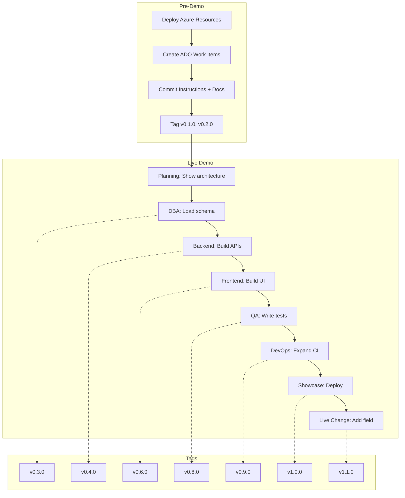

<!-- markdownlint-disable-file -->
# Task Research: OPS Developer Day 2026 Demo

A 2-hour live coding demo showcasing GitHub Copilot building a full-stack web application from scratch for the Ontario Public Sector. The application allows citizens to submit program requests and Ministry employees to review them.

## Task Implementation Requests

* Structure a 2-hour demo that maximizes GitHub Copilot impact for an OPS audience.
* Define the repo scaffolding, custom instructions, architecture artifacts, and ADO work items to create before the demo.
* Establish a roadmap of tagged commits and work items following the ADO workflow instructions.

## Scope and Success Criteria

* Scope: End-to-end demo plan covering planning, build (all roles), showcase, and live change. Excludes Power Platform deep dive and MyOntario SSO integration.
* Assumptions:
  * Azure resources are pre-deployed before the demo starts.
  * The ADO project `ProgramDemo-DevDay2026` in org `MngEnvMCAP675646` is the single source of work items.
  * The repo is a monorepo hosted on GitHub at `devopsabcs-engineering/ProgramDemo-DevDay2026`.
  * All work items carry the `Agentic AI` tag.
* Success Criteria:
  * A dated research document with clear demo schedule, repo structure, ADO hierarchy, and risk mitigations.
  * One selected approach for each technical decision (repo layout, i18n strategy, ODS integration, CI/CD shape).
  * Actionable next steps that an implementation agent can execute directly.

## Outline

1. Current State Assessment
2. Demo Schedule (120 minutes)
3. Repository Structure
4. Custom Instructions Strategy
5. Architecture Artifacts
6. ADO Work Item Hierarchy and Roadmap
7. Copilot Features to Showcase
8. Ontario Design System and WCAG 2.2 Integration
9. CI/CD Pipeline Design
10. Risk Mitigation
11. Key Tagged Commits Plan
12. Next Steps

### Potential Next Research

* Ontario Design System web component library compatibility with React 19
  * Reasoning: The ODS component library may have breaking changes with newer React versions.
  * Reference: https://designsystem.ontario.ca/
* Azure AI Foundry mini model selection for the notification summarization feature
  * Reasoning: Model choice affects latency and cost; needs testing before the demo.
  * Reference: https://ai.azure.com/

## Research Executed

### File Analysis

* [README.md](README.md)
  * Contains business problem, tech stack table, demo flow (Planning/Build/Showcase), key features, application screen mockups, citizen and ministry workflows, and live change demo steps.
* [.github/instructions/ado-workflow.instructions.md](.github/instructions/ado-workflow.instructions.md)
  * Defines ADO org/project, Epic > Feature > User Story/Bug hierarchy, `Agentic AI` tag requirement, `feature/{id}-desc` branch naming, `AB#` and `Fixes AB#` commit linking, PR workflow, post-merge cleanup.
* [.github/workflows/ci.yml](.github/workflows/ci.yml)
  * Auto-tags patch version on push to main. No build, test, or deploy steps.
* [.vscode/mcp.json](.vscode/mcp.json)
  * Configures `@azure-devops/mcp` server for Copilot ADO integration.
* [.gitignore](.gitignore)
  * 420-line Visual Studio / VS Code gitignore. Excludes `.vscode/*` except `settings.json`, `tasks.json`, `launch.json`, `extensions.json`, `*.code-snippets`, and `mcp.json`.

### Code Search Results

* No application code exists. The repo contains 5 files total: README.md, .gitignore, .vscode/mcp.json, one instructions file, and one CI workflow.
* No `.github/copilot-instructions.md` exists.
* Two tags exist: `v0.0.1`, `v0.0.2`.

### External Research

* Ontario Design System NPM packages: `@ongov/ontario-design-system-global-styles` (v6.0.0), `@ongov/ontario-design-system-component-library`, `@ongov/ontario-design-system-complete-styles`.
  * Source: [Ontario Design System](https://designsystem.ontario.ca/)
* WCAG 2.2 new AA criteria: Focus Not Obscured (2.4.11), Dragging Movements (2.5.7), Target Size Minimum (2.5.8), Consistent Help (3.2.6), Redundant Entry (3.3.7), Accessible Authentication (3.3.8).
  * Source: [WCAG 2.2 W3C Recommendation](https://www.w3.org/TR/WCAG22/)
* GitHub Copilot custom instructions support both repo-wide (`.github/copilot-instructions.md`) and path-specific (`.github/instructions/*.instructions.md` with `applyTo` frontmatter).
  * Source: [GitHub Docs](https://docs.github.com/en/copilot/customizing-copilot/adding-repository-custom-instructions-for-github-copilot)

### ADO Project State

* Project ID: `a18f273a-0853-4dee-8461-73b6d9446a9d`
* Process template: Agile (Epic, Feature, User Story, Task, Bug)
* Work items: 0 (completely empty backlog)
* Iterations: 3 default iterations with no dates
* Test plans: 0
* Epics backlog level is hidden by default and should be enabled

### Project Conventions

* Standards referenced: ADO workflow instructions (ado-workflow.instructions.md)
* Instructions followed: Markdown instructions, writing style instructions, prompt builder instructions

## Key Discoveries

### Project Structure

The repo is bare with 5 files. Everything needs to be created: application code, database schemas, infrastructure templates, architecture docs, custom instructions, and ADO work items. This is intentional for a "from scratch" demo.

### Implementation Patterns

The demo should follow a monorepo pattern with clear directory separation:

```text
ProgramDemo-DevDay2026/
├── .github/
│   ├── copilot-instructions.md
│   ├── instructions/
│   │   ├── ado-workflow.instructions.md  (exists)
│   │   ├── java.instructions.md
│   │   ├── react.instructions.md
│   │   └── sql.instructions.md
│   └── workflows/
│       └── ci.yml                        (exists, needs expansion)
├── .vscode/
│   └── mcp.json                          (exists)
├── docs/
│   ├── architecture.md
│   ├── data-dictionary.md
│   └── design-document.md
├── database/
│   └── migrations/
├── backend/                              (Java Spring Boot + Maven)
├── frontend/                             (React + TypeScript + Vite)
├── infra/                                (Bicep, pre-deployed)
├── README.md                             (exists)
└── .gitignore                            (exists)
```

### Complete Examples

#### Demo Schedule (120 minutes)

| Phase | Duration | Activities | Copilot Features |
|-------|----------|-----------|-----------------|
| Opening | 5 min | Business problem, what we will build | N/A |
| Planning | 15 min | User stories (M365 Chat), instruction files, architecture diagram | Chat, custom instructions |
| Infra + DBA | 15 min | Show Azure resources, load DB schema | Chat generating DDL |
| Backend | 20 min | Pull ADO story, build 2 APIs | Inline suggestions, `@workspace`, MCP |
| Frontend | 25 min | Figma to React, Ontario DS, bilingual | Inline suggestions, Chat |
| QA | 10 min | Unit tests, accessibility, test plans | `/tests`, jest-axe |
| DevOps | 10 min | Expand CI pipeline | GitHub Actions suggestions |
| Showcase | 10 min | Deploy, demonstrate | Commit message generation |
| Live Change | 7 min | Add field end-to-end | All features together |
| Wrap-up | 3 min | Summary, Q&A | N/A |

#### ADO Work Item Hierarchy

```text
Epic: OPS Program Approval System [Agentic AI]
├── Feature: Infrastructure Setup [Agentic AI]
│   ├── US: Provision Azure SQL Database
│   ├── US: Deploy App Services (backend + frontend)
│   ├── US: Configure Durable Functions
│   └── US: Set up Logic Apps for notifications
├── Feature: Database Layer [Agentic AI]
│   ├── US: Create program and program_type tables
│   ├── US: Create notification table
│   └── US: Seed program_type lookup data
├── Feature: Backend API [Agentic AI]
│   ├── US: Create Spring Boot project scaffolding
│   ├── US: Implement POST /api/programs (submit)
│   ├── US: Implement GET /api/programs (list and search)
│   └── US: Implement PUT /api/programs/{id}/review (approve/reject)
├── Feature: Citizen Portal [Agentic AI]
│   ├── US: Create React project with Ontario Design System
│   ├── US: Build Ontario header/footer layout
│   ├── US: Build program submission form
│   ├── US: Implement EN/FR language toggle
│   └── US: Build submission confirmation page
├── Feature: Ministry Portal [Agentic AI]
│   ├── US: Build program review dashboard
│   ├── US: Build program detail review page
│   └── US: Implement approve/reject workflow UI
├── Feature: Quality Assurance [Agentic AI]
│   ├── US: Write backend API unit tests
│   ├── US: Write React component unit tests
│   ├── US: Run WCAG 2.2 accessibility audit
│   └── US: Create test plan in Azure DevOps
├── Feature: CI/CD Pipeline [Agentic AI]
│   ├── US: Add build and test jobs to CI workflow
│   ├── US: Create CD workflow for Azure deployment
│   └── US: Enable Dependabot and secret scanning
└── Feature: Live Change Demo [Agentic AI]
    └── US: Add Program Budget field end-to-end
```

#### Tagged Commits Plan

Each major milestone should be tagged so the demo can fast-forward if a step fails:

| Tag | Milestone | Key Files Added |
|-----|-----------|----------------|
| `v0.1.0` | Repo scaffolding complete | copilot-instructions.md, path instructions, docs/ |
| `v0.2.0` | Architecture and data dictionary | docs/architecture.md, docs/data-dictionary.md |
| `v0.2.1` | Demo rehearsal starting point | Talk track, infra deployed, zero app code |
| `v0.3.0` | Database schema loaded | database/migrations/V001-V003 |
| `v0.4.0` | Backend API working (2 endpoints) | backend/ full Spring Boot project |
| `v0.5.0` | Frontend scaffolding with Ontario DS | frontend/ with layout, i18n |
| `v0.6.0` | Citizen submission form working | frontend/src/components/program/ |
| `v0.7.0` | Ministry review portal working | frontend/src/pages/MinistryPortal.tsx |
| `v0.8.0` | Tests passing with coverage | backend/test/, frontend/tests/ |
| `v0.9.0` | CI pipeline expanded | .github/workflows/ci.yml (build + test) |
| `v1.0.0` | Demo complete, deployed | Full working application |
| `v1.1.0` | Live change (budget field) | Updated DB, API, UI, tests |

### API and Schema Documentation

Core data model (Azure SQL):

| Table | Columns | Purpose |
|-------|---------|---------|
| `program` | id, program_name, program_description, program_type_id, status, submitted_by, reviewed_by, review_comments, document_url, created_date, updated_date | Main entity |
| `program_type` | id, type_name_en, type_name_fr | Lookup table (bilingual) |
| `notification` | id, program_id, recipient_email, notification_type, sent_date, status | Email tracking |

Core API endpoints (Spring Boot):

| Method | Path | Description |
|--------|------|-------------|
| POST | /api/programs | Submit a new program request |
| GET | /api/programs | List programs (with search query param) |
| GET | /api/programs/{id} | Get program details |
| PUT | /api/programs/{id}/review | Approve or reject a program |

### Configuration Examples

#### `.github/copilot-instructions.md` (key sections)

```markdown
# OPS Program Approval Demo

## Project Context
Full-stack web application for Ontario Public Sector program approval.
Citizens submit requests via React portal; Ministry reviews via internal portal.

## Tech Stack
- Frontend: React + TypeScript + Vite + i18next
- Backend: Java 21 + Spring Boot 3.x + Maven
- Database: Azure SQL
- Cloud: Azure App Service, Durable Functions, Logic Apps, AI Foundry

## Coding Standards
- All user-facing text must use i18next keys (never hardcoded strings)
- All UI must meet WCAG 2.2 AA and use Ontario Design System classes
- Semantic HTML, associated labels, accessible forms
- RESTful API design with DTOs, validation, proper HTTP status codes
- Flyway-style versioned SQL migrations
- Branch naming: feature/{work-item-id}-description
- Commit linking: AB#{id}, auto-close: Fixes AB#{id}
```

## Technical Scenarios

### Scenario: Demo Execution Strategy

The demo must balance impressive live coding with reliable execution in front of a large audience.

**Requirements:**

* 120 minutes wall clock time with buffer for minor issues.
* All code written live (not copy-pasted) to demonstrate Copilot value.
* Azure infrastructure pre-deployed to avoid provisioning delays.
* ADO work items pre-created so developers can pull stories immediately.
* Key commits tagged for fast-forward recovery.

**Preferred Approach:**

* Pre-create all scaffolding (instructions, docs, ADO work items) before the demo. Build all application code live using Copilot. Tag each major milestone. This approach maximizes the "wow factor" of Copilot generating real code while eliminating the risk of infrastructure or configuration issues derailing the demo.

```text
Pre-demo setup (30-60 min before):
├── Azure resources deployed and tested
├── ADO Epic/Features/Stories created with Agentic AI tag
├── copilot-instructions.md and path instructions committed
├── docs/architecture.md and docs/data-dictionary.md committed
├── v0.1.0 and v0.2.0 tags created
└── All dependencies cached locally

Live demo (120 min):
├── Planning: Show pre-created docs, explain ADO hierarchy (15 min)
├── Build: Write all code live with Copilot assistance (80 min)
├── Showcase: Deploy and demonstrate (10 min)
├── Live Change: End-to-end field addition (7 min)
└── Q&A (3 min + 5 min buffer absorbed from build phase)
```



**Implementation Details:**

Files to create before the demo:

1. `.github/copilot-instructions.md` with project context, tech stack, coding standards, accessibility rules, and Git workflow.
2. `.github/instructions/java.instructions.md` with `applyTo: "backend/**/*.java"` covering Spring Boot 3.x patterns.
3. `.github/instructions/react.instructions.md` with `applyTo: "frontend/**/*.tsx,frontend/**/*.ts"` covering Ontario DS, i18next, WCAG.
4. `.github/instructions/sql.instructions.md` with `applyTo: "database/**/*.sql"` covering Azure SQL conventions.
5. `docs/architecture.md` with Mermaid diagram showing all system components.
6. `docs/data-dictionary.md` with table and column definitions.
7. `docs/design-document.md` with technical decisions and security model.
8. ADO Epic with 8 Features and approximately 28 User Stories, all tagged `Agentic AI`.

#### Considered Alternatives

**Alternative A: Fully pre-built application, demo as walkthrough.**
Rejected because the audience wants to see Copilot generate code, not review existing code. This approach lacks the "from scratch" narrative.

**Alternative B: Everything live including Azure provisioning.**
Rejected because Azure resource provisioning takes 5-15 minutes per resource and is not a Copilot feature. It would consume 30+ minutes of dead time.

**Alternative C: Multiple separate repos (backend, frontend, infra).**
Rejected because switching repos during a live demo creates confusion and breaks the narrative flow. A monorepo keeps everything in one VS Code window.

## Actionable Next Steps

### Immediate (pre-demo setup)

1. Create `.github/copilot-instructions.md` with repository-wide project context and coding standards.
2. Create path-specific instructions: `java.instructions.md`, `react.instructions.md`, `sql.instructions.md`.
3. Create `docs/architecture.md` with Mermaid architecture diagram.
4. Create `docs/data-dictionary.md` with table definitions.
5. Create `docs/design-document.md` with technical decisions.
6. Create ADO Epic "OPS Program Approval System" with `Agentic AI` tag.
7. Create 8 ADO Features under the Epic, each with `Agentic AI` tag.
8. Create approximately 28 User Stories under the Features, each with `Agentic AI` tag.
9. Assign iteration dates to the 3 default iterations in ADO.
10. Expand `.github/workflows/ci.yml` to include placeholder build and test jobs for backend and frontend.
11. Add `docs/`, `database/`, `backend/`, `frontend/`, `infra/` directory placeholders.
12. Commit and tag as `v0.1.0` (scaffolding) and `v0.2.0` (architecture + data dictionary).

### During demo

13. Follow the tagged commit plan from `v0.3.0` through `v1.1.0`.
14. Pull ADO user stories via MCP before each build section.
15. Use `Fixes AB#{id}` in PR descriptions to auto-close stories.

### Post-demo

16. Clean up feature branches per ADO workflow instructions.
17. Update README with final demo results and links.
