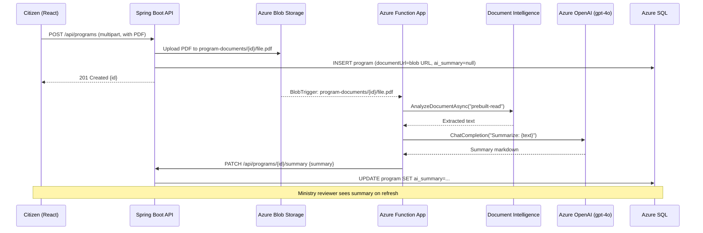

<!-- markdownlint-disable-file -->
# Task Research: PDF Attachment + AI Summarization for Ministry Review

Citizens attach a supporting PDF document when submitting a program request. An AI service automatically reads the PDF and produces a plain-language summary that ministry reviewers see on the Review Detail page. The goal is to use the simplest Microsoft-provided approach rather than building OCR or summarization logic from scratch.

## Task Implementation Requests

* Allow file attachment (PDF) in the program submission form
* Use Azure AI to summarize the PDF automatically
* Display the AI summary on the ministry review page
* Leverage the pattern from [Intelligent-PDF-Summarizer-Dotnet](https://github.com/devopsabcs-engineering/Intelligent-PDF-Summarizer-Dotnet)
* Keep implementation as simple as possible using Microsoft-provided services

## Scope and Success Criteria

* **Scope:** Front-end upload UI → backend blob storage → Azure Function (blob-triggered) → Document Intelligence + Azure OpenAI → summary stored in Azure SQL → displayed in review UI.
* **Assumptions:** Uploaded PDFs are digital (not purely scanned images); ≤50 MB per file; Azure Function App and Storage Account already exist.
* **Success Criteria:**
  * Citizen can attach a PDF during program submission
  * PDF is stored securely in Azure Blob Storage (no public access)
  * AI summary is automatically generated within 30–60 seconds of upload
  * Ministry reviewer sees the summary on the Review Detail page
  * All resources use Managed Identity (no secrets in config)

## Outline

1. Reference repo analysis (Intelligent-PDF-Summarizer-Dotnet)
2. Current codebase gap analysis
3. Recommended architecture (selected approach)
4. Infrastructure changes (Bicep)
5. Backend changes (Java Spring Boot)
6. Frontend changes (React + TypeScript)
7. Azure Function implementation (.NET, reusing reference repo)
8. Database migration (Flyway)
9. Alternatives considered

---

## Research Executed

### File Analysis

* [backend/src/main/java/com/ontario/demo/programdemo/controller/ProgramController.java](../../../backend/src/main/java/com/ontario/demo/programdemo/controller/ProgramController.java)
  * Accepts JSON only; no `MultipartFile` parameter; `documentUrl` is a plain string field
* [frontend/src/pages/SubmitProgram.tsx](../../../frontend/src/pages/SubmitProgram.tsx)
  * No `<input type="file">` exists; form posts JSON body
* [frontend/src/services/api.ts](../../../frontend/src/services/api.ts)
  * `Content-Type: application/json` hardcoded; no `FormData` path
* [infra/modules/storage.bicep](../../../infra/modules/storage.bicep)
  * StorageV2; Standard_LRS; `allowBlobPublicAccess: false`; no document containers defined
* [infra/main.bicep](../../../infra/main.bicep)
  * Function App provisioned as dotnet-isolated; shares same Storage Account; no Document Intelligence or OpenAI resources

### Code Search Results

* `documentUrl` — found in `Program.java` (entity), `ProgramDto.java`, `V002__create_program_table.sql`: plain string column, max 500 chars
* `storage` in `infra/` — one module: `storage.bicep`; referenced in `main.bicep` for `AzureWebJobsStorage`

### External Research

* `github_repo` + `fetch_webpage`: `https://github.com/devopsabcs-engineering/Intelligent-PDF-Summarizer-Dotnet`
  * Single-file Durable Functions app; blob trigger → Document Intelligence → OpenAI via `[TextCompletionInput]` binding
  * Source: [PdfSummarizer.cs](https://github.com/devopsabcs-engineering/Intelligent-PDF-Summarizer-Dotnet/blob/main/PdfSummarizer.cs)
* `mcp_azure_mcp_documentation`: Azure AI Content Understanding, Azure OpenAI Assistants, Document Intelligence
  * Source: [Document Intelligence Overview](https://learn.microsoft.com/en-us/azure/ai-services/document-intelligence/overview)
  * Source: [OpenAI File Search](https://learn.microsoft.com/en-us/azure/ai-services/openai/how-to/file-search)

### Project Conventions

* Standards referenced: Flyway versioned migrations (`V00N__`), Spring Boot multipart config, Ontario Design System file input styling
* Infrastructure: Bicep; Managed Identity for all service-to-service auth; no connection string secrets

---

## Key Discoveries

### Project Structure

The project already has:

| Asset | Location | Relevance |
|---|---|---|
| Azure Storage Account | `infra/modules/storage.bicep` | Can add PDF blob container with zero new resource cost |
| Azure Function App | `infra/main.bicep` (dotnet-isolated) | Can host blob-triggered summarizer — exact match for reference repo |
| Managed Identity on App Service | `infra/modules/sql-admin-identity.bicep` | Grant `Storage Blob Data Contributor` for passwordless uploads |
| `documentUrl` DB column | `V002__create_program_table.sql` | Repurpose to store blob URL; add `ai_summary` column |

### Implementation Patterns

Reference repo uses exactly 4 activities in a Durable orchestrator:

```
AnalyzePdf → WriteExtractedText → SummarizeText → WriteDoc
```

For this project, `WriteDoc` is replaced by a **callback HTTP POST** back to the Spring Boot API to store the summary in Azure SQL, which is simpler than having the Function App write directly to the database.

---

## Technical Scenarios

### Selected Approach: Blob Trigger + Document Intelligence + Azure OpenAI (GA, matches reference repo)

This approach reuses the reference repo pattern almost verbatim, leverages the already-provisioned Function App and Storage Account, and requires no Preview features.

**Requirements:**

* Azure Document Intelligence resource (new)
* Azure OpenAI resource with `gpt-4o` deployment (new)
* Blob container `program-documents` in existing Storage Account
* `ai_summary NVARCHAR(MAX)` column in `program` table
* New `/api/programs/{id}/summary` PATCH endpoint in Spring Boot

**Architecture flow:**

```text
Citizen submits form with PDF
    → React: POST multipart/form-data to /api/programs (with file)
    → Spring Boot: upload PDF to Azure Blob Storage
        (blob name: {programId}/{filename}.pdf)
    → Spring Boot: save record with documentUrl = blob URL
    → Azure Blob Trigger fires on Function App
        → AnalyzePdf: Document Intelligence prebuilt-read → plain text
        → SummarizeText: Azure OpenAI gpt-4o chat completion
        → CallbackToApi: PATCH /api/programs/{id}/summary with summary text
    → Ministry opens Review Detail: sees AI summary
```



**Implementation Details:**

#### 1. Infrastructure (Bicep)

New resources to add to `infra/main.bicep`:

```bicep
// Azure Document Intelligence (Cognitive Services)
module documentIntelligence 'modules/document-intelligence.bicep' = {
  name: 'documentIntelligence'
  params: {
    location: location
    resourceToken: resourceToken
    tags: tags
  }
}

// Azure OpenAI
module openAi 'modules/openai.bicep' = {
  name: 'openAi'
  params: {
    location: location
    resourceToken: resourceToken
    tags: tags
    chatModelDeploymentName: 'gpt-4o'
  }
}
```

Changes to `infra/modules/storage.bicep` — add blob container:

```bicep
resource programDocumentsContainer 'Microsoft.Storage/storageAccounts/blobServices/containers@2023-05-01' = {
  parent: blobService
  name: 'program-documents'
  properties: {
    publicAccess: 'None'
  }
}
```

RBAC assignments needed:

```bicep
// App Service identity → Storage Blob Data Contributor (for upload)
// Function App identity → Storage Blob Data Contributor (for blob trigger read/write)
// Function App identity → Cognitive Services User (for Document Intelligence)
// Function App identity → Cognitive Services OpenAI User (for Azure OpenAI)
```

#### 2. Database Migration (Flyway)

New file: `backend/src/main/resources/db/migration/V004__add_ai_summary_to_program.sql`

```sql
-- V004__add_ai_summary_to_program.sql
ALTER TABLE program
    ADD ai_summary NVARCHAR(MAX) NULL,
    ai_summary_generated_date DATETIME2 NULL;
```

#### 3. Backend: Spring Boot Changes

**a. Add Azure Blob Storage dependency to `pom.xml`:**

```xml
<dependency>
  <groupId>com.azure</groupId>
  <artifactId>azure-storage-blob</artifactId>
  <version>12.28.0</version>
</dependency>
<dependency>
  <groupId>com.azure</groupId>
  <artifactId>azure-identity</artifactId>
  <version>1.14.0</version>
</dependency>
```

**b. New `BlobStorageService.java`:**

```java
@Service
public class BlobStorageService {
    private final BlobServiceClient client;

    public BlobStorageService(@Value("${azure.storage.blob-service-uri}") String blobServiceUri) {
        this.client = new BlobServiceClientBuilder()
            .endpoint(blobServiceUri)
            .credential(new DefaultAzureCredentialBuilder().build())
            .buildClient();
    }

    public String uploadDocument(Long programId, MultipartFile file) throws IOException {
        String blobName = programId + "/" + sanitize(file.getOriginalFilename());
        BlobClient blob = client
            .getBlobContainerClient("program-documents")
            .getBlobClient(blobName);
        blob.upload(BinaryData.fromBytes(file.getBytes()), true);
        return blob.getBlobUrl();
    }
}
```

**c. Updated `ProgramController.java` — change `POST /api/programs` to accept `multipart/form-data`:**

```java
@PostMapping(consumes = MediaType.MULTIPART_FORM_DATA_VALUE)
@ResponseStatus(HttpStatus.CREATED)
public ProgramDto submitProgram(
    @RequestPart("program") @Valid ProgramRequest request,
    @RequestPart(value = "document", required = false) MultipartFile document
) {
    Program program = programService.create(request);
    if (document != null && !document.isEmpty()) {
        String url = blobStorageService.uploadDocument(program.getId(), document);
        programService.updateDocumentUrl(program.getId(), url);
    }
    return programMapper.toDto(program);
}
```

**d. New `PATCH /api/programs/{id}/summary` endpoint (for Function App callback):**

```java
@PatchMapping("/{id}/summary")
public void updateSummary(@PathVariable Long id,
                          @RequestBody SummaryCallbackDto dto) {
    programService.updateAiSummary(id, dto.getSummary());
}
```

**e. `application.yml` additions:**

```yaml
azure:
  storage:
    blob-service-uri: ${AZURE_STORAGE_BLOB_SERVICE_URI}

spring:
  servlet:
    multipart:
      max-file-size: 50MB
      max-request-size: 55MB
```

#### 4. Frontend: React Changes

**a. `SubmitProgram.tsx` — add file input:**

```tsx
const [documentFile, setDocumentFile] = useState<File | null>(null);

// In form JSX (Ontario Design System styling):
<div className="ontario-form-group">
  <label className="ontario-label" htmlFor="document">
    {t('submit.document')}
    <span className="ontario-label__flag">{t('common.optional')}</span>
  </label>
  <p id="document-hint" className="ontario-hint">
    {t('submit.documentHint')}
  </p>
  <input
    className="ontario-input"
    type="file"
    id="document"
    name="document"
    accept=".pdf"
    aria-describedby="document-hint"
    onChange={(e) => setDocumentFile(e.target.files?.[0] ?? null)}
  />
</div>
```

**b. `api.ts` — change `submitProgram` to use `FormData`:**

```ts
export async function submitProgram(data: ProgramFormData, document?: File): Promise<Program> {
  const form = new FormData();
  form.append('program', new Blob([JSON.stringify(data)], { type: 'application/json' }));
  if (document) {
    form.append('document', document);
  }
  const response = await apiClient.post<Program>('/programs', form, {
    headers: { 'Content-Type': 'multipart/form-data' },
  });
  return response.data;
}
```

**c. i18n keys to add (`en/translation.json` and `fr/translation.json`):**

```json
// EN
"submit.document": "Supporting Document (PDF)",
"submit.documentHint": "Attach a PDF document to help reviewers understand your program. Maximum 50 MB.",

// FR
"submit.document": "Document justificatif (PDF)",
"submit.documentHint": "Joignez un document PDF pour aider les examinateurs à comprendre votre programme. Maximum 50 Mo."
```

**d. `ReviewDetail.tsx` — display summary:**

```tsx
{program.aiSummary && (
  <section aria-labelledby="ai-summary-heading">
    <h2 id="ai-summary-heading" className="ontario-h3">
      {t('review.aiSummary')}
    </h2>
    <div className="ontario-callout">
      <p className="ontario-callout__body">{program.aiSummary}</p>
      <p className="ontario-hint">{t('review.aiSummaryDisclaimer')}</p>
    </div>
  </section>
)}
```

#### 5. Azure Function App (New .NET Project)

Create a new minimal .NET 8 isolated worker project `functions/PdfSummarizer/` based on the reference repo:

```csharp
// BlobTrigger listens on program-documents/{id}/{name}
[Function(nameof(TriggerProcessDocument))]
public static async Task<string> TriggerProcessDocument(
    [BlobTrigger("program-documents/{programId}/{name}")] Stream pdfStream,
    string programId, string name,
    [DurableClient] DurableTaskClient client)
{
    return await client.ScheduleNewOrchestrationInstanceAsync(
        nameof(ProcessDocument), new { ProgramId = programId, BlobName = name });
}

// Activities: AnalyzePdf (Document Intelligence) → SummarizeText (OpenAI) → CallbackApi (PATCH /programs/{id}/summary)
```

**Key difference from reference repo:** Last activity POSTs summary back to Spring Boot API instead of writing to blob output container. Uses `HttpClient` with Managed Identity token.

---

## Considered Alternatives

### Option A: Azure OpenAI Assistants API + File Search

- Pros: ~20 lines of code; no separate OCR step; uploads PDF directly to Azure OpenAI
- Cons: Still **Preview** as of Feb 2026; Microsoft recommends Foundry Agent Service for GA; file size limits (512 MB but vector store limits apply); does not support blob trigger pattern
- **Not selected:** Preview status is a risk for a government production application

### Option B: Azure AI Content Understanding

- Pros: GA; structured JSON output with confidence scores; single API call
- Cons: Requires AI Foundry project resource (additional infrastructure); analyzer schema definition adds setup steps; less documentation/examples than OpenAI path; no direct mapping to reference repo patterns
- **Not selected:** More infrastructure overhead and less alignment with reference repo

### Option C: Azure Language Service Native Document Summarization

- Pros: One-step summarization recognized by Language service
- Cons: Preview; ≤10 MB limit (too small for program submissions); input must be via Blob SAS URL (more plumbing); extractive only without additional config
- **Not selected:** File size limit is a hard blocker

---

## Actionable Next Steps for Implementation

1. **Bicep:** Add `infra/modules/document-intelligence.bicep` and `infra/modules/openai.bicep`; update `infra/modules/storage.bicep` to add `program-documents` container; add 4 RBAC assignments
2. **Database:** Create `backend/src/main/resources/db/migration/V004__add_ai_summary_to_program.sql`
3. **Backend:** Add Azure Blob Storage SDK to `pom.xml`; add `BlobStorageService`; update `ProgramController` to `multipart/form-data`; add `PATCH /api/programs/{id}/summary` callback endpoint; update entity + DTO + mapper for `aiSummary` field
4. **Frontend:** Add `<input type="file" accept=".pdf">` to `SubmitProgram.tsx`; update `api.ts` to use `FormData`; add i18n keys; update `ReviewDetail.tsx` to show summary
5. **Functions:** Create `functions/PdfSummarizer/` .NET 8 project adapting reference repo; replace `WriteDoc` activity with HTTP callback to API
6. **CI/CD:** Update `.github/workflows/ci-cd.yml` to build and publish the new Functions project

## Potential Next Research

* Exact Bicep schema for `Microsoft.CognitiveServices/accounts@2024-04-01-preview` (Document Intelligence S0 tier) and `Microsoft.CognitiveServices/accounts/deployments` (OpenAI gpt-4o)
  * Reasoning: Need correct API version and SKU for Managed Identity auth
  * Reference: https://learn.microsoft.com/en-us/azure/templates/microsoft.cognitiveservices/accounts
* Spring Boot 3.x multipart + Azure Blob SDK integration patterns (potential streaming vs buffering trade-offs for large PDFs)
* Ontario Design System file input accessible validation patterns (error on non-PDF file type, file size exceeded)
* Function App callback authentication — how to secure the `PATCH /summary` endpoint so only the Function App identity can call it (use Managed Identity + `spring-security-oauth2-resource-server`)
