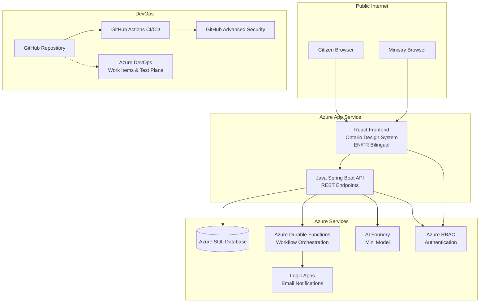

# Demo Structure Research: 2-Hour GitHub Copilot Live Coding Demo

**Date:** 2026-02-16
**Audience:** Ontario Public Sector (OPS) Developer Day 2026
**Objective:** Build a full-stack web application from scratch using GitHub Copilot

---

## 1. Optimal Time Split for a 2-Hour Demo

### Recommended Schedule (120 minutes)

| Phase | Duration | % of Total | Activities |
|-------|----------|-----------|------------|
| **Opening and Context** | 5 min | 4% | Welcome, business problem, what we will build |
| **Planning** | 15 min | 13% | M365 Chat for user stories, Copilot for instructions and architecture |
| **Build: Infrastructure and DBA** | 15 min | 13% | Show pre-deployed Azure resources, load database schema |
| **Build: Backend Developer** | 20 min | 17% | Pull ADO user story, build Java APIs with Copilot |
| **Build: Front-End Developer** | 25 min | 21% | Figma to React, Ontario Design System, bilingual UI |
| **Build: QA** | 10 min | 8% | Unit tests, test plans, push to ADO |
| **Build: DevOps** | 10 min | 8% | CI pipeline with GitHub Actions, security scanning |
| **Showcase** | 10 min | 8% | Deploy to public URL, demonstrate working application |
| **Live Change** | 7 min | 6% | Add a field, show Copilot handling iterative changes |
| **Wrap-up and Q&A** | 3 min | 2% | Summary, key takeaways, questions |

### Key Principles

- **Front-load the wow factor:** Start the build phase with something visible early (database schema and a working API) so the audience sees tangible progress within the first 30 minutes.
- **Keep transitions tight:** Pre-stage branches, terminal windows, and browser tabs. Switching between roles (DBA, Backend, Frontend, QA, DevOps) should feel like a natural handoff, not a context switch.
- **Narrate the prompts:** Always explain what you are asking Copilot to do and why. The audience learns more from seeing the prompt engineering than from watching code scroll by.
- **Have checkpoints:** After each role, pause for 10 seconds to confirm the current state is working (compile, run, test). This catches problems early and provides natural breathing room for the audience.

---

## 2. Pre-Created Files and Scaffolding

### Must Have Before the Demo Starts

| Item | Reason |
|------|--------|
| **Azure resources deployed** | Provisioning takes too long to do live. Have App Service, Azure SQL, Durable Functions, Logic Apps, and AI Foundry ready. |
| **Empty database with connection string** | The DBA role will load the schema live, but the server must be reachable. |
| **Repository with README.md** | Already exists. Contains business problem, tech stack, and demo flow. |
| **`.github/copilot-instructions.md`** | Repository-wide custom instructions for Copilot. |
| **`.github/instructions/*.instructions.md`** | Path-specific custom instructions (Java, React, SQL, CI/CD). |
| **`.vscode/mcp.json`** | ADO MCP server configuration (already exists). |
| **`.vscode/settings.json`** | Editor settings for the demo (font size, theme, formatOnSave). |
| **Figma prototype link** | Public or embedded mockup screenshots for the frontend developer role. |
| **ADO work items (Epics, Features, User Stories)** | Pre-created in ADO with `Agentic AI` tag so the backend developer can pull a story immediately. |
| **`.gitignore`** | Already exists. Should exclude `node_modules/`, `target/`, `.env`, etc. |
| **`docs/architecture.md`** | High-level architecture diagram (Mermaid or image). |
| **`docs/data-dictionary.md`** | Table and column definitions for the database schema. |
| **Ontario Design System assets** | NPM packages referenced in instructions, not pre-installed (install live). |

### Should NOT Pre-Create (Build Live)

| Item | Copilot Feature to Highlight |
|------|------------------------------|
| Database schema SQL | Copilot Chat generating DDL from data dictionary |
| Java project scaffolding | `/new` or `@workspace` agent for Spring Boot project |
| React project scaffolding | `npx create-react-app` or Vite with Copilot guidance |
| API endpoints | Inline completions and chat for REST controller code |
| React components | Chat generating components from Figma mockups |
| Unit tests | `/tests` slash command |
| CI/CD pipeline YAML | Copilot generating GitHub Actions workflow |

---

## 3. GitHub Copilot Features to Highlight

### Priority Features for the Demo

| Feature | When to Show | Impact |
|---------|-------------|--------|
| **Copilot Chat (side panel)** | Planning phase: generate architecture, explain decisions | Shows Copilot as a thinking partner, not just autocomplete |
| **Custom instructions (`.github/copilot-instructions.md`)** | Setup phase: show file, explain how it guides all suggestions | Demonstrates enterprise governance and standards enforcement |
| **Path-specific instructions (`.github/instructions/`)** | When switching roles (Java vs React) | Shows how different instructions apply to different file types |
| **Inline suggestions (ghost text)** | Backend and frontend coding | The classic Copilot experience that is always impressive |
| **Inline chat (`Ctrl+I`)** | Quick fixes, adding comments, small refactors | Shows speed of in-place edits |
| **`@workspace` agent** | Asking about project structure, finding files | Shows Copilot understanding the whole codebase |
| **`/tests` slash command** | QA phase | Generates tests instantly |
| **`/doc` slash command** | After writing an API endpoint | Generates JSDoc/Javadoc in seconds |
| **`/explain` slash command** | When reviewing generated code | Demonstrates code comprehension |
| **`/fix` slash command** | When a build error occurs (plan for one) | Shows debugging assistance |
| **MCP tools (ADO integration)** | Pulling user stories, creating test plans | Shows Copilot integrated with project management |
| **Commit message generation (sparkles)** | Every commit | Quick win that always impresses |
| **GitHub Actions Copilot suggestions** | DevOps phase | Shows Copilot knows CI/CD patterns |
| **GitHub Advanced Security** | After push: show Dependabot, secret scanning | Demonstrates security-first development |

### Demo Script Tips from GitHub Best Practices

1. **Open relevant files** before asking Copilot questions. Having the data dictionary open while writing SQL gives Copilot the context it needs.
2. **Use meaningful names** for variables and functions. `submitProgramRequest()` produces dramatically better suggestions than `handleSubmit()`.
3. **Provide top-level comments** describing the intent of each file before letting Copilot generate code.
4. **Set imports manually** for the Ontario Design System packages to guide Copilot toward the right component library.
5. **Highlight code before asking chat questions** to give targeted context.

---

## 4. Recommended Repository Structure

### React + Java + Azure SQL Project Layout

```text
ProgramDemo-DevDay2026/
├── .github/
│   ├── copilot-instructions.md          # Repository-wide Copilot instructions
│   ├── instructions/
│   │   ├── ado-workflow.instructions.md  # ADO workflow rules (exists)
│   │   ├── java.instructions.md          # Java/Spring Boot coding standards
│   │   ├── react.instructions.md         # React + Ontario DS standards
│   │   ├── sql.instructions.md           # Azure SQL conventions
│   │   └── cicd.instructions.md          # GitHub Actions conventions
│   └── workflows/
│       ├── ci.yml                        # CI pipeline (exists)
│       ├── cd.yml                        # CD pipeline (deploy to Azure)
│       └── security.yml                  # CodeQL / dependency review
├── .vscode/
│   ├── mcp.json                          # MCP server config (exists)
│   ├── settings.json                     # Editor settings
│   └── launch.json                       # Debug configurations
├── docs/
│   ├── architecture.md                   # Architecture diagram (Mermaid)
│   ├── data-dictionary.md                # Database schema documentation
│   ├── design-document.md                # Technical design decisions
│   └── adr/                              # Architecture Decision Records
│       └── 001-tech-stack.md
├── infra/
│   ├── bicep/                            # Azure Bicep templates (pre-deployed)
│   │   ├── main.bicep
│   │   └── modules/
│   └── scripts/
│       └── deploy.sh
├── database/
│   ├── migrations/
│   │   ├── V001__create_programs_table.sql
│   │   ├── V002__create_users_table.sql
│   │   └── V003__seed_data.sql
│   └── README.md
├── backend/
│   ├── pom.xml                           # Maven project
│   ├── src/
│   │   ├── main/
│   │   │   ├── java/
│   │   │   │   └── ca/ontario/programdemo/
│   │   │   │       ├── ProgramDemoApplication.java
│   │   │   │       ├── config/
│   │   │   │       │   ├── SecurityConfig.java
│   │   │   │       │   └── CorsConfig.java
│   │   │   │       ├── controller/
│   │   │   │       │   ├── ProgramController.java
│   │   │   │       │   └── HealthController.java
│   │   │   │       ├── service/
│   │   │   │       │   └── ProgramService.java
│   │   │   │       ├── repository/
│   │   │   │       │   └── ProgramRepository.java
│   │   │   │       ├── model/
│   │   │   │       │   ├── Program.java
│   │   │   │       │   └── ProgramType.java
│   │   │   │       └── dto/
│   │   │   │           ├── ProgramRequest.java
│   │   │   │           └── ProgramResponse.java
│   │   │   └── resources/
│   │   │       ├── application.yml
│   │   │       ├── application-dev.yml
│   │   │       └── messages/
│   │   │           ├── messages_en.properties
│   │   │           └── messages_fr.properties
│   │   └── test/
│   │       └── java/
│   │           └── ca/ontario/programdemo/
│   │               ├── controller/
│   │               │   └── ProgramControllerTest.java
│   │               └── service/
│   │                   └── ProgramServiceTest.java
│   └── Dockerfile
├── frontend/
│   ├── package.json
│   ├── vite.config.ts                    # Vite for fast builds
│   ├── tsconfig.json
│   ├── public/
│   │   ├── favicon.ico                   # Ontario favicon
│   │   └── locales/
│   │       ├── en/
│   │       │   └── translation.json
│   │       └── fr/
│   │           └── translation.json
│   ├── src/
│   │   ├── main.tsx
│   │   ├── App.tsx
│   │   ├── i18n.ts                       # i18next configuration
│   │   ├── components/
│   │   │   ├── layout/
│   │   │   │   ├── Header.tsx            # Ontario header component
│   │   │   │   ├── Footer.tsx            # Ontario footer component
│   │   │   │   └── LanguageToggle.tsx    # EN/FR toggle
│   │   │   ├── program/
│   │   │   │   ├── ProgramForm.tsx
│   │   │   │   ├── ProgramList.tsx
│   │   │   │   └── ProgramDetail.tsx
│   │   │   └── common/
│   │   │       ├── Button.tsx
│   │   │       ├── Input.tsx
│   │   │       └── Alert.tsx
│   │   ├── pages/
│   │   │   ├── CitizenPortal.tsx
│   │   │   ├── MinistryPortal.tsx
│   │   │   └── SearchPage.tsx
│   │   ├── services/
│   │   │   └── api.ts
│   │   ├── hooks/
│   │   │   └── usePrograms.ts
│   │   ├── styles/
│   │   │   └── ontario-overrides.scss
│   │   └── types/
│   │       └── program.ts
│   ├── tests/
│   │   ├── components/
│   │   │   └── ProgramForm.test.tsx
│   │   └── setup.ts
│   └── Dockerfile
├── .gitignore
├── README.md
└── docker-compose.yml                    # Local development
```

### Key Structural Decisions

- **Monorepo with separate `backend/` and `frontend/` directories.** This makes it easy to demonstrate each role independently while keeping everything in one repository for the demo.
- **Vite over Create React App.** Vite provides faster builds and hot module replacement, which matters during a live demo.
- **TypeScript for the frontend.** Copilot produces significantly better suggestions with TypeScript because of type information.
- **Spring Boot with Maven for the backend.** Standard OPS-friendly stack with excellent Copilot support.
- **i18next for internationalization.** Industry standard for React bilingual support (EN/FR).
- **BEM CSS classes following Ontario Design System naming.** The ODS uses BEM convention (e.g., `.ontario-header`, `.ontario-fieldset__legend`).

---

## 5. Essential GitHub Copilot Custom Instructions

### Repository-Wide Instructions (`.github/copilot-instructions.md`)

```markdown
# OPS Program Approval Demo - Copilot Instructions

## Project Overview
This is the Developer Day 2026 demo for the Ontario Public Sector (OPS). It is a
full-stack web application where citizens submit program requests and Ministry
employees review them through an internal portal.

## Tech Stack
- **Frontend:** React with TypeScript, Vite, i18next for EN/FR bilingual support
- **Backend:** Java 21, Spring Boot 3.x, Maven
- **Database:** Azure SQL
- **Cloud:** Azure App Service, Durable Functions, Logic Apps, AI Foundry
- **CI/CD:** GitHub Actions
- **Project Management:** Azure DevOps (User Stories, Test Plans)

## Coding Standards

### General
- All user-facing text must be bilingual (English and French) using i18next keys,
  never hardcoded strings.
- All UI components must meet WCAG 2.2 Level AA accessibility standards.
- All UI must follow the Ontario Design System (https://designsystem.ontario.ca/).
- Use semantic HTML elements (nav, main, section, article, aside, header, footer).
- Every form input must have an associated label and appropriate autocomplete attribute.

### Frontend (React + TypeScript)
- Use functional components with hooks exclusively.
- Use the Ontario Design System CSS classes with BEM naming (e.g., `ontario-button`,
  `ontario-input`).
- Minimum touch target size: 24x24 CSS pixels (WCAG 2.5.8).
- Color contrast: minimum 4.5:1 for normal text, 3:1 for large text (WCAG 1.4.3).
- Include aria-labels, aria-describedby, and role attributes where needed.
- Use react-router for navigation with descriptive page titles.
- All forms must include error identification (WCAG 3.3.1) and error suggestions
  (WCAG 3.3.3).

### Backend (Java / Spring Boot)
- Follow RESTful API design conventions.
- Use Spring Data JPA for database access.
- Include input validation on all endpoints (@Valid, @NotNull, @Size).
- Return proper HTTP status codes (200, 201, 400, 404, 500).
- Include request/response DTOs separate from entity classes.
- Use Spring MessageSource for backend bilingual messages.

### Database
- Use Flyway-style versioned migration scripts (V001__, V002__, etc.).
- Table names: lowercase, underscores, singular (e.g., program, program_type).
- Column names: lowercase, underscores (e.g., program_name, created_date).
- Always include: id (PK), created_date, updated_date, created_by columns.

### Testing
- Frontend: Jest + React Testing Library.
- Backend: JUnit 5 + Mockito + Spring Boot Test.
- Target 80% code coverage minimum.
- Include accessibility tests using jest-axe for React components.

### CI/CD
- GitHub Actions workflows in `.github/workflows/`.
- Validate both backend and frontend on every pull request.
- Include linting, unit tests, and build checks in CI.

### Git Workflow
- Branch naming: feature/{work-item-id}-short-description
- Commit messages: Include AB#{work-item-id} for ADO linking.
- PR descriptions: Include Fixes AB#{work-item-id} to auto-close.

## Repository Layout
- `backend/` - Java Spring Boot API
- `frontend/` - React TypeScript application
- `database/` - SQL migration scripts
- `infra/` - Azure Bicep templates
- `docs/` - Architecture, data dictionary, design documents
```

### Path-Specific Instructions

**`.github/instructions/java.instructions.md`**
```markdown
---
applyTo: "backend/**/*.java"
---
- Use Java 21 features (records, sealed classes, pattern matching) where appropriate.
- Follow Spring Boot 3.x conventions.
- Use constructor injection, not field injection.
- Include Javadoc on all public classes and methods.
- Use Lombok @Data, @Builder, @AllArgsConstructor for DTOs.
- Handle exceptions with @ControllerAdvice and return ProblemDetail responses.
```

**`.github/instructions/react.instructions.md`**
```markdown
---
applyTo: "frontend/**/*.tsx,frontend/**/*.ts"
---
- Use Ontario Design System classes from @ongov/ontario-design-system-global-styles.
- Install with: npm install --save @ongov/ontario-design-system-global-styles
- Import theme: @import '@ongov/ontario-design-system-global-styles/dist/styles/css/compiled/ontario-theme.css'
- BEM naming convention: .ontario-{block}__{element}--{modifier}
- Use i18next useTranslation() hook for all user-visible text.
- Wrap pages in Ontario header and footer layout components.
- Use `lang` attribute on html element, toggle between "en" and "fr".
- WCAG 2.2: Ensure focus indicators are visible (2.4.7), focus not obscured (2.4.11).
- WCAG 2.2: Provide dragging alternatives (2.5.7) for any drag interactions.
- WCAG 2.2: Accessible authentication - no cognitive function tests (3.3.8).
- WCAG 2.2: No redundant entry - pre-fill previously entered data (3.3.7).
```

**`.github/instructions/sql.instructions.md`**
```markdown
---
applyTo: "database/**/*.sql"
---
- Target Azure SQL Database.
- Use versioned migration naming: V{number}__{description}.sql
- Include IF NOT EXISTS guards on CREATE statements.
- Use NVARCHAR for all text columns to support bilingual content.
- Always include primary key constraints.
- Add appropriate indexes for columns used in WHERE clauses and JOINs.
```

---

## 6. Architecture Artifacts to Create Early

### Recommended Documents (Create Before or During Planning Phase)

| Artifact | Format | When to Create | Purpose |
|----------|--------|---------------|---------|
| **Architecture diagram** | Mermaid in `docs/architecture.md` | Planning phase (live with Copilot) | Shows system components and data flow |
| **Data dictionary** | Markdown table in `docs/data-dictionary.md` | Planning phase (live with Copilot) | Drives database schema, API models, and form fields |
| **Design document** | Markdown in `docs/design-document.md` | Pre-created or early planning | Technical decisions, security model, deployment strategy |
| **ADR: Tech stack** | Markdown in `docs/adr/001-tech-stack.md` | Pre-created | Justifies React, Java, Azure SQL choices |
| **API contract** | OpenAPI/Swagger or Markdown | Build with backend developer | Defines endpoints for frontend integration |

### Architecture Diagram (Mermaid Example)



### Data Dictionary (Core Tables)

| Table | Column | Type | Description |
|-------|--------|------|-------------|
| `program` | `id` | BIGINT PK | Auto-increment primary key |
| `program` | `program_name` | NVARCHAR(200) | Name of the program (bilingual) |
| `program` | `program_description` | NVARCHAR(MAX) | Detailed description |
| `program` | `program_type_id` | INT FK | Reference to program_type lookup |
| `program` | `status` | NVARCHAR(50) | DRAFT, SUBMITTED, UNDER_REVIEW, APPROVED, REJECTED |
| `program` | `submitted_by` | NVARCHAR(100) | Citizen email or user ID |
| `program` | `reviewed_by` | NVARCHAR(100) | Ministry employee who reviewed |
| `program` | `review_comments` | NVARCHAR(MAX) | Comments from reviewer |
| `program` | `document_url` | NVARCHAR(500) | URL to uploaded supporting document |
| `program` | `created_date` | DATETIME2 | Record creation timestamp |
| `program` | `updated_date` | DATETIME2 | Last modification timestamp |
| `program_type` | `id` | INT PK | Auto-increment primary key |
| `program_type` | `type_name_en` | NVARCHAR(100) | English type name |
| `program_type` | `type_name_fr` | NVARCHAR(100) | French type name |
| `notification` | `id` | BIGINT PK | Auto-increment primary key |
| `notification` | `program_id` | BIGINT FK | Reference to program |
| `notification` | `recipient_email` | NVARCHAR(200) | Email address |
| `notification` | `notification_type` | NVARCHAR(50) | SUBMISSION_CONFIRMATION, DECISION |
| `notification` | `sent_date` | DATETIME2 | When notification was sent |
| `notification` | `status` | NVARCHAR(50) | PENDING, SENT, FAILED |

---

## 7. Recommended ADO Work Item Hierarchy

### Epic Structure

```text
Epic: OPS Program Approval System
├── Feature: Infrastructure Setup
│   ├── User Story: Provision Azure SQL Database
│   ├── User Story: Deploy Azure App Service for backend
│   ├── User Story: Deploy Azure App Service for frontend
│   ├── User Story: Configure Azure Durable Functions
│   └── User Story: Set up Azure Logic Apps for notifications
│
├── Feature: Database Layer
│   ├── User Story: Create program table schema
│   ├── User Story: Create program_type lookup table
│   ├── User Story: Create notification table schema
│   └── User Story: Seed program_type with initial data
│
├── Feature: Backend API
│   ├── User Story: Create Spring Boot project scaffolding
│   ├── User Story: Implement POST /api/programs (submit program)
│   ├── User Story: Implement GET /api/programs (list programs)
│   ├── User Story: Implement GET /api/programs/{id} (get program detail)
│   ├── User Story: Implement PUT /api/programs/{id}/review (approve/reject)
│   ├── User Story: Implement GET /api/programs/search (search by name)
│   └── Bug: [Reserved for live issues]
│
├── Feature: Frontend - Citizen Portal
│   ├── User Story: Create React project with Ontario Design System
│   ├── User Story: Build Ontario header and footer layout
│   ├── User Story: Build program submission form
│   ├── User Story: Implement EN/FR language toggle
│   ├── User Story: Build submission confirmation page
│   └── User Story: Implement program search page
│
├── Feature: Frontend - Ministry Portal
│   ├── User Story: Build program review dashboard
│   ├── User Story: Build program detail review page
│   └── User Story: Implement approve/reject workflow UI
│
├── Feature: Quality Assurance
│   ├── User Story: Write unit tests for backend API
│   ├── User Story: Write unit tests for React components
│   ├── User Story: Run accessibility audit (WCAG 2.2)
│   ├── User Story: Create test plan in Azure DevOps
│   └── User Story: Verify bilingual content completeness
│
├── Feature: CI/CD Pipeline
│   ├── User Story: Create GitHub Actions CI workflow for backend
│   ├── User Story: Create GitHub Actions CI workflow for frontend
│   ├── User Story: Create CD workflow to deploy to Azure
│   ├── User Story: Enable Dependabot for dependency scanning
│   └── User Story: Enable secret scanning and code scanning
│
└── Feature: Live Change Demo
    ├── User Story: Add "Program Budget" field to submission form
    └── User Story: Update all layers for new field (DB, API, UI, tests)
```

### Recommended Demo Execution Order

During the live demo, work items should be pulled in this order to create a natural build narrative:

1. **Infrastructure** (show pre-deployed, mark stories as Done)
2. **Database Layer** (DBA role: create tables live)
3. **Backend API: Submit Program** (Backend Developer: first API)
4. **Backend API: List Programs** (Backend Developer: second API)
5. **Frontend: Create React Project** (Front-End Developer: scaffolding)
6. **Frontend: Ontario Header/Footer** (Front-End Developer: layout)
7. **Frontend: Program Submission Form** (Front-End Developer: main form)
8. **Frontend: Language Toggle** (Front-End Developer: bilingual)
9. **QA: Unit Tests** (QA: tests for backend and frontend)
10. **QA: Accessibility Audit** (QA: WCAG 2.2 check)
11. **CI/CD: CI Workflow** (DevOps: GitHub Actions)
12. **Showcase: Deploy and Demonstrate** (everyone: deploy to public URL)
13. **Live Change** (if time: add new field end-to-end)

### ADO Tags and Metadata

- **Tag all work items** with `Agentic AI` (per ADO workflow instructions).
- **Assign iteration** to "Sprint 1 - Demo Day".
- **Set priority** based on demo order (1 = infrastructure, 13 = live change).
- **Use AB# linking** in all commits and PRs.

---

## 8. Ontario Design System Integration with React

### NPM Packages

| Package | Purpose | Install Command |
|---------|---------|----------------|
| `@ongov/ontario-design-system-global-styles` | Global CSS, fonts, favicons | `npm install --save @ongov/ontario-design-system-global-styles` |
| `@ongov/ontario-design-system-component-library` | Web components (optional, for richer elements) | `npm install --save @ongov/ontario-design-system-component-library` |
| `@ongov/ontario-design-system-complete-styles` | Complete styles bundle (alternative to global) | `npm install --save @ongov/ontario-design-system-complete-styles` |

### Integration Steps

1. Install the global styles package.
2. Import the theme CSS in the main entry file:
   ```css
   @import '@ongov/ontario-design-system-global-styles/dist/styles/css/compiled/ontario-theme.css';
   ```
3. Use BEM-convention CSS classes from the design system:
   - `.ontario-header` for the site header
   - `.ontario-footer` for the site footer
   - `.ontario-button` for buttons
   - `.ontario-input` for form inputs
   - `.ontario-fieldset__legend` for form fieldset legends
4. The design system uses ITCSS architecture with layers: Variables, Tools, Generics, Elements, Layout, Components, Overrides.
5. Current version: 2.3.0 (January 15, 2026).
6. Requires Dart Sass 1.71.0+ if using SCSS with `pkg:` imports.

### Bilingual (EN/FR) Implementation

- Use `i18next` + `react-i18next` for runtime language switching.
- Store translations in `public/locales/en/translation.json` and `public/locales/fr/translation.json`.
- Set the `lang` attribute on the `<html>` element dynamically.
- Use `lang` attribute on `<span>` or `<div>` elements when mixing languages (WCAG 3.1.2: Language of Parts).
- The Ontario Design System provides French versions of its documentation at `designsystem.ontario.ca/fr/`.

---

## 9. WCAG 2.2 Compliance Checklist for the Demo

### New in WCAG 2.2 (Must Address for AA Compliance)

| Criterion | Level | What It Means | Demo Impact |
|-----------|-------|---------------|-------------|
| 2.4.11 Focus Not Obscured (Minimum) | AA | Focused element must not be fully hidden by other content | Ensure sticky headers/modals do not cover focused fields |
| 2.5.7 Dragging Movements | AA | Dragging actions must have non-drag alternatives | No drag-only interactions in program form |
| 2.5.8 Target Size (Minimum) | AA | Clickable targets must be at least 24x24 CSS px | Buttons and links in Ontario DS already meet this |
| 3.2.6 Consistent Help | A | Help mechanisms must be in same location across pages | Place help links in consistent footer/header position |
| 3.3.7 Redundant Entry | A | Do not ask users to re-enter previously provided data | Pre-fill fields when navigating back in the form |
| 3.3.8 Accessible Authentication (Minimum) | AA | No cognitive function tests for authentication | Use standard password + copy/paste or OAuth |

### Essential AA Criteria to Demonstrate

- **1.4.3 Contrast:** 4.5:1 minimum (Ontario DS colors are pre-tested).
- **1.4.11 Non-text Contrast:** 3:1 for UI components and graphical objects.
- **2.1.1 Keyboard:** All functionality operable via keyboard.
- **2.4.7 Focus Visible:** Clear focus indicators on all interactive elements.
- **3.1.1 Language of Page:** Set `lang="en"` or `lang="fr"` on `<html>`.
- **3.1.2 Language of Parts:** Mark French content blocks with `lang="fr"`.
- **3.3.1 Error Identification:** Identify form errors in text, not just color.
- **3.3.2 Labels or Instructions:** Every input has a visible label.
- **4.1.2 Name, Role, Value:** Custom components expose name and role to assistive tech.
- **4.1.3 Status Messages:** Use ARIA live regions for dynamic updates.

### React Accessibility Libraries

| Library | Purpose |
|---------|---------|
| `jest-axe` | Automated accessibility testing in Jest |
| `eslint-plugin-jsx-a11y` | Lint rules for accessibility issues |
| `@axe-core/react` | Runtime accessibility warnings in development |

---

## 10. Risk Mitigation for Live Demo

### Common Failure Points and Mitigations

| Risk | Mitigation |
|------|-----------|
| **Network failure** | Pre-cache npm/maven dependencies. Have offline fallback branches with code at various stages. |
| **Azure service unavailable** | Have a pre-deployed backup environment. Test all connections 30 minutes before demo. |
| **Copilot generates wrong code** | Practice the prompts. Have known-good prompts in a cheat sheet. If Copilot fails live, narrate the correction as "this is normal; here is how you guide it." |
| **Database connection timeout** | Pre-warm the Azure SQL database (it can pause if unused). Run a SELECT 1 before demo. |
| **Build failure during demo** | Have Git tags at each checkpoint. If a step fails, fast-forward to the next tag. |
| **Time overrun** | Assign strict time budgets per section. Have a "minimum viable demo" that takes 90 minutes and an "extended demo" for the full 120. |
| **Audience questions disrupt flow** | Acknowledge questions and park them for Q&A unless they are directly relevant to the current step. |

### Pre-Demo Checklist

- [ ] Azure resources are running and accessible
- [ ] Database connection string is in environment variables
- [ ] All NPM and Maven dependencies are cached locally
- [ ] VS Code is configured with correct font size (16px+), theme, and extensions
- [ ] ADO work items are created and accessible via MCP
- [ ] Git branches are clean, on `main`
- [ ] Figma mockup screenshots are accessible offline
- [ ] Backup branch tags exist at each checkpoint
- [ ] Practice run completed in under 110 minutes

---

## Sources Consulted

1. [GitHub Copilot Best Practices](https://docs.github.com/en/copilot/using-github-copilot/best-practices-for-using-github-copilot) - Official GitHub documentation
2. [GitHub Copilot Custom Instructions](https://docs.github.com/en/copilot/customizing-copilot/adding-repository-custom-instructions-for-github-copilot) - Repository instruction file format
3. [Using GitHub Copilot in Your IDE: Tips, Tricks, and Best Practices](https://github.blog/developer-skills/github/how-to-use-github-copilot-in-your-ide-tips-tricks-and-best-practices/) - GitHub Blog
4. [Ontario Design System](https://designsystem.ontario.ca/) - Version 2.3.0, January 2026
5. [Ontario Design System Global Styles NPM Package](https://www.npmjs.com/package/@ongov/ontario-design-system-global-styles) - Version 6.0.0
6. [Ontario Design System Developer Guide](https://designsystem.ontario.ca/docs/documentation/develop/for-developers.html)
7. [WCAG 2.2 Specification](https://www.w3.org/TR/WCAG22/) - W3C Recommendation, December 2024
8. [How to Meet WCAG 2.2 Quick Reference](https://www.w3.org/WAI/WCAG22/quickref/)
9. [GitHub Copilot Tutorials Library](https://docs.github.com/en/copilot/using-github-copilot/guides-on-using-github-copilot)
