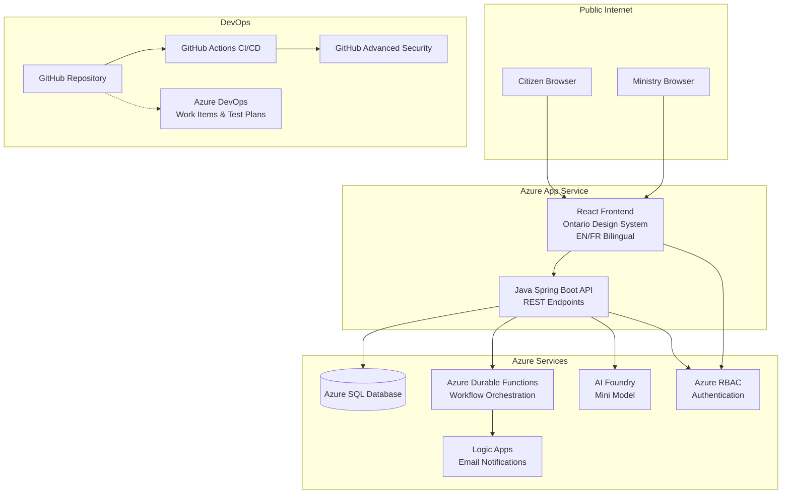

# Architecture

## Overview

The OPS Program Approval System is a full-stack web application enabling Ontario citizens to submit program requests through a public portal and Ministry employees to review and approve or reject submissions through an internal portal. The system uses Azure cloud services for hosting, workflow orchestration, notifications, and AI-powered summarization.

## Architecture Diagram

## Component Descriptions

| Component | Technology | Purpose | Notes |
|-----------|-----------|---------|-------|
| React Frontend | React, TypeScript, Vite | Public and internal portal UI | Ontario Design System, EN/FR bilingual with i18next |
| Java Backend API | Java 21, Spring Boot 3.x, Maven | REST API endpoints | Spring Data JPA, input validation, ProblemDetail error responses |
| Azure SQL Database | Azure SQL | Persistent data storage | Program submissions, lookup tables, notification tracking |
| Azure Durable Functions | Azure Functions | Workflow orchestration | Handles multi-step approval workflows |
| Azure Logic Apps | Logic Apps | Email notifications | Sends submission confirmations and decision notifications |
| Azure AI Foundry | AI Foundry Mini Model | AI summarization | Generates notification summaries for approved programs |
| Azure RBAC | Azure Active Directory | Authentication and authorization | Role-based access for Citizen and Ministry Employee roles |
| GitHub Actions | GitHub Actions | CI/CD pipelines | Build, test, and deploy automation |
| GitHub Advanced Security | Dependabot, Secret Scanning, Code Scanning | Security scanning | Dependency updates, secret detection, code analysis |
| Azure DevOps | Azure DevOps | Project management | User Stories, Test Plans, work item tracking |

## Data Flow

1. **Citizen submits a program request** through the React frontend public portal.
2. The frontend sends a **POST request** to the Java Spring Boot API at `/api/programs`.
3. The API **validates the input** and persists the program record to Azure SQL Database with status `SUBMITTED`.
4. The API triggers an **Azure Durable Function** to orchestrate the approval workflow.
5. The Durable Function invokes **Azure Logic Apps** to send a submission confirmation email to the citizen.
6. A **Ministry employee** opens the internal portal and views the program review dashboard.
7. The employee reviews the submission details, adds comments, and **approves or rejects** the program.
8. The frontend sends a **PUT request** to `/api/programs/{id}/review` with the decision.
9. The API updates the program status in Azure SQL and triggers the Durable Function.
10. The Durable Function invokes **Azure AI Foundry** to generate a decision summary.
11. The Durable Function invokes **Logic Apps** to send the decision notification to the citizen.

## Security Model

| Aspect | Implementation |
|--------|---------------|
| Authentication | Azure RBAC with Azure Active Directory |
| Authorization | Role-based: Citizen (submit, view own), Ministry Employee (review, decide) |
| Transport | HTTPS enforced on all endpoints |
| CORS | Configured to allow frontend origin only |
| Input Validation | @Valid annotations on all API request bodies |
| Secrets Management | Azure Key Vault or environment variables; no secrets in code |
| Dependency Scanning | GitHub Dependabot for automated dependency updates |
| Secret Scanning | GitHub secret scanning to detect committed secrets |
| Code Scanning | GitHub code scanning for static analysis |

## Deployment Topology

| Resource | Azure Service | Configuration |
|----------|--------------|---------------|
| Frontend | Azure App Service | Static build output from Vite, Ontario Design System CSS |
| Backend | Azure App Service | Java 21 JAR deployment |
| Database | Azure SQL Database | Pre-provisioned, Flyway migrations applied at startup |
| Workflows | Azure Durable Functions | Consumption plan, HTTP-triggered |
| Notifications | Azure Logic Apps | Email connector, template-based |
| AI | Azure AI Foundry | Mini model for notification summarization |
| CI/CD | GitHub Actions | Build, test, deploy workflows |
