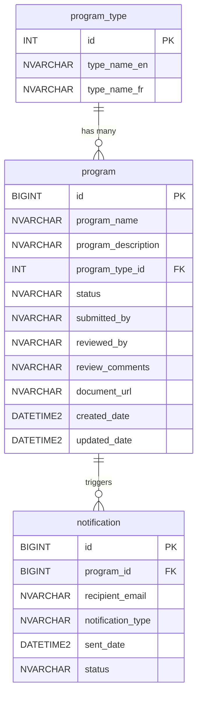

# Data Dictionary

## Overview

This document defines the database schema for the OPS Program Approval System. The database uses Azure SQL Database with NVARCHAR columns to support bilingual content (English and French). All tables follow the naming conventions defined in the project coding standards.

## Entity Relationship Diagram

## Tables

### program

The primary table storing citizen program submissions and their review status.

| Column | Type | Constraints | Description |
|--------|------|-------------|-------------|
| id | BIGINT | PK, IDENTITY(1,1) | Auto-increment primary key |
| program_name | NVARCHAR(200) | NOT NULL | Name of the program |
| program_description | NVARCHAR(MAX) | NOT NULL | Detailed description of the program request |
| program_type_id | INT | FK to program_type.id, NOT NULL | Reference to the program type lookup table |
| status | NVARCHAR(50) | NOT NULL, DEFAULT 'DRAFT' | Current status: DRAFT, SUBMITTED, UNDER_REVIEW, APPROVED, REJECTED |
| submitted_by | NVARCHAR(100) | NULL | Citizen email or user ID who submitted the request |
| reviewed_by | NVARCHAR(100) | NULL | Ministry employee who reviewed the submission |
| review_comments | NVARCHAR(MAX) | NULL | Comments added by the reviewer |
| document_url | NVARCHAR(500) | NULL | URL to the uploaded supporting document |
| created_date | DATETIME2 | NOT NULL, DEFAULT GETUTCDATE() | Record creation timestamp |
| updated_date | DATETIME2 | NOT NULL, DEFAULT GETUTCDATE() | Last modification timestamp |

### program_type

Lookup table for program categories. Contains bilingual names.

| Column | Type | Constraints | Description |
|--------|------|-------------|-------------|
| id | INT | PK, IDENTITY(1,1) | Auto-increment primary key |
| type_name_en | NVARCHAR(100) | NOT NULL | English display name for the program type |
| type_name_fr | NVARCHAR(100) | NOT NULL | French display name for the program type |

### notification

Tracks email notifications sent to citizens throughout the approval process.

| Column | Type | Constraints | Description |
|--------|------|-------------|-------------|
| id | BIGINT | PK, IDENTITY(1,1) | Auto-increment primary key |
| program_id | BIGINT | FK to program.id, NOT NULL | Reference to the associated program |
| recipient_email | NVARCHAR(200) | NOT NULL | Email address of the notification recipient |
| notification_type | NVARCHAR(50) | NOT NULL | Type of notification: SUBMISSION_CONFIRMATION, DECISION |
| sent_date | DATETIME2 | NULL | Timestamp when the notification was sent |
| status | NVARCHAR(50) | NOT NULL, DEFAULT 'PENDING' | Delivery status: PENDING, SENT, FAILED |

## Seed Data

### program_type

| id | type_name_en | type_name_fr |
|----|-------------|-------------|
| 1 | Health | Santé |
| 2 | Education | Éducation |
| 3 | Infrastructure | Infrastructure |
| 4 | Social Services | Services sociaux |
| 5 | Environment | Environnement |

## Indexes

| Table | Index Name | Columns | Purpose |
|-------|-----------|---------|---------|
| program | IX_program_status | status | Filter programs by approval status |
| program | IX_program_submitted_by | submitted_by | Look up programs by citizen |
| program | IX_program_program_type_id | program_type_id | Join with program_type table |
| program | IX_program_created_date | created_date | Sort and filter by submission date |
| notification | IX_notification_program_id | program_id | Look up notifications for a program |
| notification | IX_notification_status | status | Monitor pending notifications |
